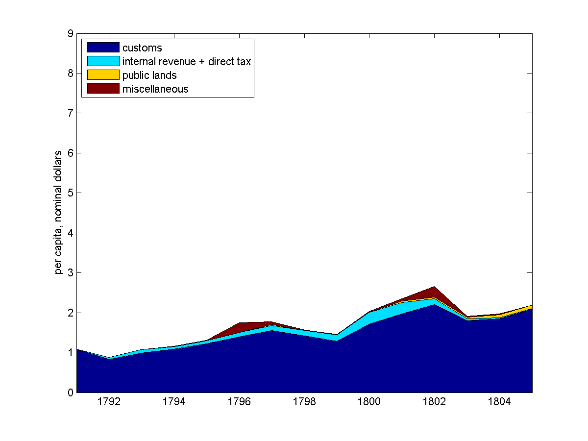

.. _act1790:

*******************************************************
The Constitution and the Funding Act of 1790
*******************************************************

Important Dates
===============

    +--------------------+----------------------------------------------------------------+
    | Summer 1787        | Constitutional Convention in Philadelphia                      |
    +--------------------+----------------------------------------------------------------+
    | June 1788          | Constitution Ratified                                          |
    +--------------------+----------------------------------------------------------------+
    | March 4, 1789      | The Constitution goes into effect                              |
    +--------------------+----------------------------------------------------------------+
    | April 30, 1789     | Inauguration of President George Washington                    |
    +--------------------+----------------------------------------------------------------+
    | July 14, 1789      | Storming of the Bastille -- French Revolution begins           | 
    +--------------------+----------------------------------------------------------------+
    | 1790               | Establishment of the Department of Treasury                    |
    +--------------------+----------------------------------------------------------------+
    | August 4, 1790     | Funding Act                                                    |
    +--------------------+----------------------------------------------------------------+

The U.S. Constitution
======================

* Constitutional Convention negotiated in the Summer of 1787

* met to revise Articles

    * Independence Hall, Philadelphia
    * adopted on September 17, 1787

* Ratified by conventions in eleven states

* Went into effect on March 4, 1789.

* The full text is available from the `National Archives`_

.. _National Archives: http://www.archives.gov/exhibits/charters/constitution.html

Financial Provisions of the Constitution
-----------------------------------------

* Fiscal framework of the United States

* Many of the fiscal debates (even today!) center around how to interpret phrases

* Worth reading the entire Constitution.

Article 1 - The Legislative Branch, Section 2 - The House
----------------------------------------------------------

The Noxious 3/5 Rule

Representatives and direct Taxes shall be apportioned among the several States which may be
included within this Union, according to their respective Numbers, which shall be determined by
adding to the whole Number of free Persons, including those bound to Service for a Term of Years,
and excluding Indians not taxed, three fifths of all other Persons.

This 3/5 rule was eliminated by the 14th Amendment.

Article 1 - The Legislative Branch, Section 8 - Powers of Congress
-------------------------------------------------------------------

The Congress shall have Power To lay and collect Taxes, Duties, Imposts and Excises, to pay the
Debts and provide for the common Defence and general Welfare of the United States; but all Duties,
Imposts and Excises shall be uniform throughout the United States;

To borrow money on the credit of the United States;

To regulate Commerce with foreign Nations, and among the several States, and with the Indian Tribes;

To coin Money, regulate the Value thereof, and of foreign Coin, and fix the Standard of Weights
and Measures;

To provide for the Punishment of counterfeiting the Securities and current Coin of the United
States;

Article 1 - The Legislative Branch, Section 9 - Limits on Congress
-------------------------------------------------------------------

No capitation, or other direct, Tax shall be laid, unless in Proportion to the Census or
Enumeration herein before directed to be taken.

No Tax or Duty shall be laid on Articles exported from any State.

No Preference shall be given by any Regulation of Commerce or Revenue to the Ports of one State
over those of another: nor shall Vessels bound to, or from, one State, be obliged to enter, clear,
or pay Duties in another.

No Money shall be drawn from the Treasury, but in Consequence of Appropriations made by Law; and a
regular Statement and Account of the Receipts and Expenditures of all public Money shall be
published from time to time.

Points
-------

* Congress has the power to tax and borrow with only a few limitations

              *common defense and general welfare*

* Those limitations are

      * taxes must be "uniform" throughout the U.S.
      * direct taxes (requisitions?) proportional to the population
      * taxes on exports forbidden

* Direct vs. Indirect taxes

Direct Taxation
---------------

* The limitation

*No capitation, or other direct, Tax shall be laid, unless in Proportion to the Census or
Enumeration herein before directed to be taken.*

* Amendment 16 - Status of Income Tax Clarified

The Congress shall have power to lay and collect taxes on incomes, from whatever source
derived, without apportionment among the several States, and without regard to any census or
enumeration.

Expenditures
------------

Congress has the power to

* to pay the Debts and provide for the common Defence and general Welfare of the United States*

There are no explicit limitations.  What does "general Welfare" mean?

Article 1 - The Legislative Branch, Section 10 - Powers Prohibited of States
-----------------------------------------------------------------------------

No State shall enter into any Treaty, Alliance, or Confederation; grant Letters of Marque and
Reprisal; coin Money; emit Bills of Credit; make any Thing but gold and silver Coin a Tender in
Payment of Debts; pass any Bill of Attainder, ex post facto Law, or Law impairing the Obligation
of Contracts, or grant any Title of Nobility.

No State shall, without the Consent of the Congress, lay any Imposts or Duties on Imports or
Exports, except what may be absolutely necessary for executing it's inspection Laws: and the net
Produce of all Duties and Imposts, laid by any State on Imports or Exports, shall be for the Use
of the Treasury of the United States; and all such Laws shall be subject to the Revision and
Controul of the Congress.

Points
-------

* States cannot issue money

* States cannot impose tariffs or customs

Article 6 - Debts, Supremacy, Oaths
------------------------------------

All Debts contracted and Engagements entered into,
before the Adoption of this Constitution, shall be as valid
against the United States under this Constitution, as under the Confederation.

State Debts
------------

* States paid for  many of the costs of the Revolutionary War

        * State militias

* Record keeping was not always carefully done.

   
     +----------------+--------------------+---------------------+---------------+
     |  State         |  Hamilton's        | Authorized in       |  Actually     |
     +                +                    +                     +               +
     |                | Estimate for 1789  | Funding Act         |  Assumed      |
     +================+====================+=====================+===============+   
     | New Hampshire  |    \$300,000       |    \$300,000        |    \$282,597  |
     +----------------+--------------------+---------------------+---------------+
     | Massachusetts  |    5,226,801       |    4,000,000        |    3,981,733  | 
     +----------------+--------------------+---------------------+---------------+
     | Rhode Island   |                    |      200,000        |      200,000  | 
     +----------------+--------------------+---------------------+---------------+
     | Connecticut    |    1,951,173       |    1,600,000        |    1,600,000  |  
     +----------------+--------------------+---------------------+---------------+
     | New York       |    1,167,575       |    1,200,000        |    1,183,717  | 
     +----------------+--------------------+---------------------+---------------+
     | New Jersey     |      788,681       |      800,000        |      695,203  | 
     +----------------+--------------------+---------------------+---------------+
     | Pennsylvania   |    2,200,000       |    2,200,000        |      777,984  | 
     +----------------+--------------------+---------------------+---------------+
     | Delaware       |                    |      200,000        |       59,162  | 
     +----------------+--------------------+---------------------+---------------+
     | Maryland       |      800,000       |      800,000        |      517,491  | 
     +----------------+--------------------+---------------------+---------------+
     | Virginia       |    3,680,743       |    3,500,000        |    2,934,416  | 
     +----------------+--------------------+---------------------+---------------+
     | North Carolina |                    |    2,400,000        |    1,793,804  | 
     +----------------+--------------------+---------------------+---------------+
     | South Carolina |    5,386,232       |    4,000,000        |    3,999,652  | 
     +----------------+--------------------+---------------------+---------------+
     | Georgia        |                    |      300,000        |      246,031  | 
     +----------------+--------------------+---------------------+---------------+
     | Total          |  \$25,000,000      |   \$21,500,000      | \$18,271,787  |
     +----------------+--------------------+---------------------+---------------+

The framers' hatred of paper money
==================================

The framers of the U.S. Constitution wanted to prevent the U.S. and the states from issuing and repudiating a currency again.

An earlier draft of the Constitution had actually given the Congress substantially more authority than that, including the right to issue bills of credit.

On the morning of August 16, 1787, the eighth clause of the seventh article in the draft of the constitution said
that "The legislature of the United States shall have the power to borrow money and emit bills on the credit of the United States."   

`Madison\`s notes of the convention\`s proceedings on August 16, 1787`_  record a debate about a motion 
to strike out the clause authorizing congress to emit bills of credit, 
excerpts that impress us for their sophistication in

.. _Madison\`s notes of the convention\`s proceedings on August 16, 1787: http://avalon.law.yale.edu/18th_century/debates_816.asp

   1. stressing the *ex ante* advantages in terms of promoting credit to be reaped by denying future 
   government decision makers the authority to take actions that *ex post*  would occasionally tempt 
   them (James Wilson)  
   
   2. appreciating  advantages of reserving for future decision makers the flexibility to deal with 
   unforeseeable contingencies (George Mason and Edmund Randolph); and  
   
   3. arguing that the most damaging effects from issuing a Federal paper money would be prevented if the 
   government could not make it  legal tender (James Madison).
   
On pages 67-68, Dewey discusses and cites the entire debate of August 16, including contributions we have omitted.

Here are some excerpts from the debate:

    **Mr. Govr. MORRIS** moved to strike out "and emit bills on the credit of the U. States" -- If
    the United States had credit such bills would be unnecessary: if they had not, unjust  \& useless.

    **Mr. BUTLER**, 2ds. the motion.

    **Mr. MADISON**, will it not be sufficient to prohibit the making them
    a *[legal] tender*? This will remove the temptation to emit
    them with unjust views. And promissory notes in that shape may in
    some emergencies be best.

    **Mr. Govr. MORRIS.** striking out the words will leave room still for
    notes of a responsible minister which will do all the good without
    the mischief. The Monied interest will oppose the plan of
    Government, if paper emissions be not prohibited.

    **Mr. GHORUM** was for striking out, without inserting any prohibition. 
    if the words stand they may suggest and lead to the measure.

    **Col.  MASON** had doubts on the subject. Congs. he thought
    would not have the power unless it were expressed. Though he had a
    mortal hatred to paper money, yet *as he could not foresee all
    emergences, he was unwilling to tie the hands of the Legislature.*
    He observed that the late war could not have been carried on, had
    such a prohibition existed.

    **Mr. GHORUM** The power as far as it will be necessary or safe, is involved in that of borrowing.

    **Mr. MERCER** was a friend to paper money, though in the present state  \& temper of America, 
    he should neither propose nor approve of such a measure.  He was consequently opposed 
    to a prohibition of it altogether. It will stamp suspicion on the Government to deny 
    it a discretion on this point. It was impolitic also to excite the opposition 
    of all those who were friends to paper money. The people of 
    property would be sure to be on the side of the plan, and it 
    was impolitic to purchase their further attachment with the loss of the opposite class of Citizens

    **Mr. ELSEWORTH** thought this a favorable moment to shut and bar the door against paper money.
    The mischiefs of the various experiments which had been made, were
    now fresh in the public mind and had excited the disgust of all
    the respectable part of America. By withholding the power from the
    new Governt. more friends of influence would be gained to it than
    by almost any thing else. Paper money can in no case be necessary.
    Give the Government credit, and other resources will offer. The
    power may do harm, never good.

    **Mr. RANDOLPH**, notwithstanding his antipathy to paper money, could
    not agree to strike out the words, as *he could not foresee
    all the occasions which might arise.*

    **Mr. WILSON.** It will have a most salutary influence on the credit
    of the U. States to remove the possibility of paper money. This
    expedient can never succeed whilst its mischiefs are remembered,
    and as long as it can be resorted to, it will be a bar to other
    resources.

    **Mr. BUTLER.** remarked that paper was a legal tender in no Country in Europe.
    He was urgent for disarming the Government of such a power.

    **Mr. MASON** was still averse to tying the hands of the Legislature
    altogether. If there was no example in Europe as just remarked, it
    might be observed on the other side, that there was none in which
    the Government was restrained on this head.

    **Mr. READ,** thought the words, if not struck out, would be as
    alarming as the mark of the Beast in Revelations.

    **Mr. LANGDON** had rather reject the whole plan than retain the three
    words "and emit bills".

    On the motion for striking out

    N. H. ay. Mas. ay. Ct ay. N. J. no. Pa. ay. Del. ay. Md. no. Va.
    ay. [FN23] N. C. ay. S. C. ay. Geo. ay.

The motion to strike out carried 9 states to 2, but the Convention did not  go further and  
impose an explicit prohibition. 

Thus, the framers opted for silence instead of  explicitly prohibiting the federal government
from issuing bills of credit. 

Nevertheless, during the first three quarters of the nineteenth century, it was widely believed 
that the framers had intended to shut the door on making
a paper money a legal tender, and that the fact that they did not go further and
explicitly prohibit the federal government from issuing bills of credit simply reflected the 
constitutional convention delegates' presumption that powers not explicitly awarded should be 
understood to be denied to Congress.

Or could it have reflected a preference for leaving some ambiguity about their intentions 
as a concession to George Mason's argument about unforeseen contingencies.

His extensive review of the documentary record convinced
Bancroft [Bancroft1886]_ that  the  framers intended that
Congress not be permitted to make a paper currency a legal tender:

     *The refusal of the convention to confer on the legislature of the United States the power to emit bills of credit or irredeemable paper money in any form is so complete that according to all rules by which public documents are interpreted, it should not be treated as questionable;*
     
See page 43 of [Bancroft1886]_.
 
To strengthen his point, Bancroft cited rousing statements from Washington, Madison, and 
many others deploring the evils that flow when government makes
a paper currency a legal tender.    

In light of the tone of the debate reported by Madison and  Bancroft's evidence,
to represent the consensus of opinion before the civil war, Bancroft quoted Daniel Webster:

     *Most unquestionably there is no legal tender, and there can be no legal tender, in this country, 
     under the authority of this government or any other but gold and silver, either the coinage of our 
     own mints or foreign coins, at rates regulated by congress. This is a constitutional 
     principle, perfectly plain, and of the very highest importance. The states are expressly prohibited 
     from making anything but gold and silver a tender in payment of debts; and although no such express 
     prohibition is applied to congress, yet as congress has no power granted to it in this respect, 
     but to coin money and to regulate the value of foreign coins, it clearly has no power to substitute 
     paper, or anything else, for coin as a tender in payment of debts and in discharge of contracts.*

Extract from a speech delivered by Daniel Webster in the Senate of the United States on the 21st of December 
1836 on the subject of the Specie Circular, quoted by [Bancroft1886], page 93.

Bancroft's review of the historical evidence was prompted by his disapproval of the Supreme Court's 1884
decision in  *Juilliard v Greenman*, which uphold the Union's making greenback a legal tender during the civil war.

The court reasoned that because Congress had the power to pay debts,  it could do so by any means not expressly 
prohibited by the constitution; and that little  attention needed to be paid to the debates and votes at the 
constitutional convention because it was difficult to glean a consensus from them; that Congress's power to 
borrow money included the power to issue obligations in any appropriate form, including hand-to-hand
currency; and that the authority to  issue  legal tender notes accompanied the right of coinage.  

See p.366-67 of [Dewey1903].

As we will see,  by 1884, outcomes of decisions of President Ulysses S. Grant and the post-Civil War Republican 
Congresses had removed the stigma that Madison
and his colleagues had cast against Federal legal tender paper money. 

Hamilton's *Report Relative to a Provision for the Support of Public Credit*
=============================================================================

    
    **Alexander Hamilton**

* The Report without the tables is available `here`_

.. _here: http://oll.libertyfund.org/index.php?option=com_content&task=view&id=1058&Itemid=264

* January 1790, 

* Debt was "the price of liberty"

* Recommended that Congress pass a law withe four components

    1. repay the foreign debt with interest at face value

    2. issue a set of new bonds, without a maturity date, to refinance the domestic debt

    3. assume the state debt debts

    4. lower the interest rate on debt to 4 percent, but set aside money from import duties to pay interest.

* Hamilton wanted to change people's expectations about

.. math::
       \sum_{j=1}^{\infty} \left(\frac{1}{1+r}\right)^{j}(T_{t+j} - G_{t+j})

* What are the cost and benefits?

* Who are the winners and losers?

The Funding Act of August 4, 1790
----------------------------------

* Followed the recommendations of Hamilton's *Report on Public Credit* this act authorized three new loans

    1. Six per cent stock  --  paying six percent interest.

    2.  Deferred Six per cent stock  -- paying no interest until 1801, then six percent afterwards

    3.  Three per cent stock -- paying three percent interest

* Footnote: During this period the term "stock" often refereed to assets that today we refer to as "bonds".

* Owners of the

     * Domestic Federal Debt received 2/3 in the 6 percent stock and 1/3 in the deferred 6 percent.

     * Indents of Interest received 3 per cent stock.

     * State Debts received 4/9 in the 6 percent stock; 2/9 in the deferred 6 percent stock; and 3/9 in the 3 per cent stock.

     * Continental Dollars received 1 dollar in species for every 100 Continentals.

* Foreign debt was refinanced in 1795 at 1/2 percent higher interest rate.

The Grand Bargain, or America's Second Revolution
==================================================

1. The U.S. Constitution

        * transferred tariff revenue from the states to the Federal government

2. Funding Act of August 4, 1790

       * assumed the state's debt and refinanced the Federal debt

*Federal Government Bailed Out the States in Exchange for Tariff Revenue*

Discrimination Along One Dimension
----------------------------------

* Critics of this plan argued:

     * If the debt was to be funded at par, current market values were well below face value.

     * Hence, Treasury was making a huge and pointless gift to speculators

     * Thus the Treasury should *discriminate* or distinguish between the original holders of Continental securities and those who had purchased them on the secondary market.

* Madison's Plan: Treasury would partially reimburse the original holders and pay a remaining fraction of the face value to the final purchasers

* Hamilton's responded that such discrimination was

     * an administrative nightmare

     * breach of contract and would set a disastrous precedent

Discrimination Along Another Dimension
---------------------------------------

* Hamilton wanted (some) debt to be highly valued

      * provide liquid store of value
      * credibility for when the U.S. needs to return to credit markets
      * create a political constituency (i.e. the bond holders) to support a strong Federal government with a robust source of tax revenue

* There were several different classes of bondholders.
  
      * Only one group, the foreigners, were repaid at par.  
      * Most creditors received less than face value.

* Hamilton did not want fiat money to be valued.

My daughter's AP American History textbook
-------------------------------------------

The youthful financier's first objective was to bolster the national credit. Without public
confidence in the government, Hamilton could not secure the funds with which to float his risky
schemes. He therefore boldly urged Congress to "fund"  the entire national debt at par and to
assume completely the debts incurred by the states during the recent war.

     	
"Funding at par" meant that the federal government would pay off its debts at face value, plus
accumulated interest--a then-enormous total of more than \$54 million.

*The American Pageant: A History of the American People*, By David M. Kennedy,
Lizabeth Cohen, Thomas A. Bailey, Chapter 10.

Two set of votes
----------------

* First vote on the refunding passed easily

* Second vote on the assumption of the state debts

    * failed the first time
    * the dinner on Maiden Lane: Madison, Jefferson and Hamilton cut a deal
    * state debts were assumed, capital moved from New York to Washington

* Composition of the Outstanding Debt
     
.. figure:: _static/figures/debt_decomp2.png
    :scale: 60%
    :align: center

    **Composition of the Outstanding Debt**

.. figure:: _static/figures/phil_bond_prices_pre1790.png
    :scale: 60%
    :align: center

    **Philadelphia Prices of Various U.S. Debt Issues**
      
.. figure:: _static/figures/phil_sylla_bond_prices.png
    :scale: 60%
    :align: center

    **Philadelphia Prices U.S. Six Per Cent Stock, Deferred Six Per Cent Stock, and Three Per Cent Stock**

    **Philadelphia Prices of U.S. Final Settlement Certificates, Six Per Cent Stock, and Deferred Six Per Cent Stock**

.. figure:: _static/figures/phil_indents_bond_prices.png
    :scale: 60%
    :align: center

    **Philadelphia Prices of Indents of Interest and Three Per Cent Stock**

    **Philadelphia Prices of Pennsylvania Debt, North and Carolina Debt, U.S. Six Per Cent Stock and U.S. Deferred Six Per Cent Stock**

Haircuts
--------

* June 30, 1791: market prices (face value of \$100) of

     +---------------------------------+------------+
     | Bond                            | Price      | 
     +=================================+============+
     | 6\% Stock                       |  \$90.00   | 
     +---------------------------------+------------+
     | deferred 6\% Stock              |  \$50.00   |
     +---------------------------------+------------+
     | 3\% Stock                       |  \$50.00   |
     +---------------------------------+------------+

* If you exchanged \$100 (face value) you received assets worth on the market

     +------------------------------------+-----------+
     | loan office certificate            |  \$76.67  |
     +------------------------------------+-----------+
     | state debt (principal or interest) |  \$67.78  |
     +------------------------------------+-----------+
     | interest in arrears                |  \$50.00  |
     +------------------------------------+-----------+
     | Continental dollars                |   \$1.00  |
     +------------------------------------+-----------+

*Remember the market price for a loan office certificate on June 30, 1788 was less \$20.*

.. figure:: _static/figures/par_and_market_value_debt_1790.png
    :scale: 60%
    :align: center

    **Par and Market Value of the Aggregate Debt**

    **Ratio of the Market Value to the Par Value of Debt**

.. figure:: _static/figures/par_and_market_value_debt.png
    :scale: 60%
    :align: center

    **Par and Market Value of the Aggregate Debt**

.. figure:: _static/figures/ratio_market_to_par.png
    :scale: 60%
    :align: center

    **Ratio of the Market Value to the Par Value of Debt**

Implications for Federal Spending
=================================

.. epigraph::

     *The natural progress of things is for liberty to yeild, and government to gain ground.*

     -- Thomas Jefferson to Edward Carrington, Paris, May 27, 1788

.. figure:: _static/figures/per_cap_pre1790_receipts.png
    :scale: 40%
    :align: center

    **Per Capita Federal Revenue by Type**

.. figure:: _static/figures/per_cap_pre1790_expenditures.png
    :scale: 40%
    :align: center

    **Per Capita Federal Expenditure by Type**

.. figure:: _static/figures/pre1790_prim_deficit.png
    :scale: 40%
    :align: center

    **Primary Deficit Per Capita**

Wrapping Up
-----------

* Good reputations are costly to acquire

* May want different reputations with different parties

* Free-rider problem between state and central government.

     * 1790 bailout of states created view that the Federal government stood behind state debts.
     * 1840 no bailout

* Lessons for Europe???

    * There are some similarities, some differences
    * U.S. fiscal union first, monetary union second

* See *Wall Street Journal* op-ed by Tom Sargent, `An American History Lesson for Europe`_.

.. _An American History Lesson for Europe: http://online.wsj.com/news/articles/SB10001424052970204740904577193032770537826

