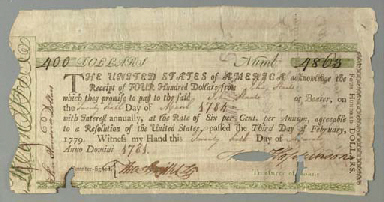

.. _american_revolution_loans:

**************************************************
The American Revolution: Loans and Fiscal Accounts
**************************************************

Loan Office Certificates
========================

* On October 3, 1776 Congress voted to borrow \$5 million Continental dollars at a 4\% interest rate.

* Loan offices were opened in each state and authorized to receive subscriptions.

* At a 4\% interest rate, few loan certificates were sold and the loan failed.

* On January 14 and February 22, 1777 Congress authorized \$15 million in new loans.

* On February 26, the interest rate was raised to 6\%. Over the next three years \$12 million of these loan certificates were sold.

* There were two types of these certificates

     1. ones that promised to pay species
     2. ones that repaid in Continental currency.

* Minimum denomination was \$300.  These certificates were not intended to circulate as currency,

    **Loan Office Certificate**

Why Would Someone Loan Money to the Revolutionaries?
----------------------------------------------------

* Lack of liquid stores of value

* Congress voted that for any loan office certificate purchased prior to March 1, 1778, the government would

   - accept bills of credit at face value to purchase loan office certificates
   - pay interest in specie (ie. Spanish dollars)

* At that time, Continental dollars traded 1.25 and 5 C.D. to Spanish dollar

   - 7.5 to 30 percent return

What the difference between bonds and money?
--------------------------------------------

* Re-write the government budget constraint as

.. math::
       B_{t} + \frac{M_t}{P_t} =  B_{t-1} + r B_{t-1} + G_t + TR_t - T_t  - \frac{M_{t-1}}{P_t}
           
* bonds pay interest, money does not

[Anderson1983]_ , page 68, lists the first six distinguishing features between Loan Office Certificates 
and Bills of Credit.  We added the seventh.

     +------------------------------------+-----------------------------------------------------------+
     |  loan office certificates          |   bills of credit                                         |
     +====================================+===========================================================+
     |     bear interest                  |   bear no interest                                        |
     +------------------------------------+-----------------------------------------------------------+
     |  written denominations             | printed denominations                                     |
     +------------------------------------+-----------------------------------------------------------+
     | payable to a specific individual   | payable to bearer                                         |  
     +------------------------------------+-----------------------------------------------------------+
     | transferable but not intended for  | intended to create a circulating medium                   | 
     | general circulation;               |                                                           |
     | not legal tender, but              |                                                           |
     | receivable for taxes               |                                                           | 
     +------------------------------------+-----------------------------------------------------------+
     | printed on one side of thick large |  printed on both sides of heavy small size paper for      |  
     | size paper                         |  convenient circulation                                   | 
     +------------------------------------+-----------------------------------------------------------+
     | written date of issue              | printed date of authorization                             |
     +------------------------------------+-----------------------------------------------------------+
     | minimum denomination: \$300        | minimum denomination: \$0.17                              |
     +------------------------------------+-----------------------------------------------------------+

* If bonds pay interest, and money does not why doesn't every use bonds to carry out trade?

      - There were essentially three types of currency circulating simultaneously.
      - Reduced demand for Continental dollars, exacerbating their depreciation.

* Pennsylvania Packet, January 20, 1780

*I only contend for the immediate dissolution of the loan office; for
why should the community be burdened with an addition of taxes, merely
to pay an interest to moneyed men, for lending paper to government;
when the very paper could be as well made without any other expense
than striking it; and the larger these bills the better: if a thousand
dollars each, it might help to retard the circulation and lessen the
charge of printing and signing.  It is to be observed, that the whole
of my reasoning on this subject, turns upon the assertion, that loan
office certificates are money to all intents and purposes, and operate
in proportion to their quantity equal to alike sum of Continental
bills -- if I am wrong my conclusions fall to the ground.*

Certificates of Indebtedness
----------------------------

To supply the army with food and supplies, the Continental Army foraged.  Foraging is
a nice way of saying "went up to local farms and homes and take what stuff."

The British and Hessian armies also relied on foraging for supplies.  Like the British,
the Continental Army had a formal policy of paying for item taken from local homes and farms.  
The Continental Congress authorized quartermasters, commissaries, and other officers to issue 
certificates of indebtedness for supplies taken for the army. 

In contrast the Hessian solider had a personal incentive to forage.  If they ate British rations, 
their pay was docked.  If they fed themselves by foraging, they were not charged.  There are no reports
that the Hessian provided the locals with any compensation for  

Regardless of whether 

In February 1782, Robert Morris nominated a commissioner for each state to 
review all civilian claims and exchange old certificates and such for *final settlement certificates*.

These final settlement certificates promised a 6 per cent interest rate.

Final Settlement Certificates
-----------------------------

A typical final settlement certificate:

Interest in Arrears
-------------------

* After March 1, 1782 the Congress of the Confederation had no resources to pay interest or principal on loan office certificates or final settlement certificates.

.. figure:: _static/figures/loan_office.png
    :scale: 60%
    :align: center

    **Specie Value of the Outstanding Loan Office Certificates**

.. figure:: _static/figures/cert_of_indebt.png
    :scale: 60%
    :align: center

    **Specie Value of the Final Settlement Certificates**

Foreign Loans
-------------

* Congress also borrowed extensively from France, Holland, and Spain.

   - financed military supplies from these countries
   - Some loans represent subsidies

* France

   - Borrowing began in 1777.
   - First loans payable in tobacco; stopped due to British navy
   - Total borrowing from France exceeded \$6.5 million

* Spain

   - Single loan from Spain for \$174,011 issued though out 1781-1782
   - Secret loan
   - American negotiators tried to get Florida in the deal.

* Holland

Debts Due to Foreign Officers
-----------------------------

* Needed to compensate  foreign officers who fought in the Continental Army during the Revolutionary War.

* Many were destitute and unable to go home.

* Initially paid certificated of indebtedness bearing an interest of 6 per cent.

   - value quickly depreciated

* On January 22, 1784 the Continental Congress authorized these certificates to be called in and new certificates to be issued.  These new certificates paid a 6 per cent coupon, payable in gold annually at a Paris bank.

* Foreign officers probably did better than their American counterparts.

    **Face Value Foreign Loans Outstanding**

Fiscal Accounting: Two Approaches
=================================

1. Stock Approach

   * aggregate the debt bond-by-bond, period-by-period
   * precise data on foreign bonds
   * incomplete data on the domestic debt, almost no data on state debts

2. Flow Approach

   * impute the debt from the stream of expenditures and revenue
   * know debt in 1775 = 0 and 1792 = \$80 million
   * no complete set of accounts for the 1776 to 1789 period

Federal Expenditure by Type
---------------------------

     +---------+-----------+---------------+-----------+----------+---------------+----------------+
     | Year    | Indians   |	   War     |  Interest | Pensions | Miscellaneous |  Total         |
     +=========+===========+===============+===========+==========+===============+================+
     | 1775-76 |  $38,476  |  $14,799,896  |           |          |  $5,226,294   |  $20,064,667   |
     +---------+-----------+---------------+-----------+----------+---------------+----------------+
     | 1777    |   22,162  |   20,133,489  |           |          |   4,830,996   |   24,986,647   |
     +---------+-----------+---------------+-----------+----------+---------------+----------------+
     | 1778    |    1,553  |   22,177,112  |           |          |   2,110,773   |   24,289,438   |
     +---------+-----------+---------------+-----------+----------+---------------+----------------+
     | 1779    |           |   10,133,473  |           |          |     661,147   |   10,794,620   |
     +---------+-----------+---------------+-----------+----------+---------------+----------------+
     | 1780    |    3,981  |    2,765,038  |           |          |     230,980   |    3,000,000   |
     +---------+-----------+---------------+-----------+----------+---------------+----------------+
     | 1781    |      823  |    1,568,580  |           |   $3,970 |     229,764   |    1,803,137   |
     +---------+-----------+---------------+-----------+----------+---------------+----------------+
     | 1782    |      562  |    2,299,289  |  \$30,398 |    4,469 |     136,172   |    2,470,891   |
     +---------+-----------+---------------+-----------+----------+---------------+----------------+
     | 1783    |    1,244  |    2,516,090  |    17,913 |    8,596 |     112,512   |    2,656,354   |
     +---------+-----------+---------------+-----------+----------+---------------+----------------+

Federal Revenue by Source
-------------------------

     +--------+--------------+---------------+---------------+---------------+---------------+
     |  Year  |    Money     | Taxes         |  Sale of      | Miscellaneous |  Total        | 
     +        +              +               +               +               +               +   
     |        |              |               | Public Goods  |               |               |                      
     +========+==============+===============+===============+===============+===============+
     | 1775   | \$6,000,000  |               |               |               |  \$6,000,000  |
     +--------+--------------+---------------+---------------+---------------+---------------+
     | 1776   |  15,270,553  |               |               |               |  15,270,553   |
     +--------+--------------+---------------+---------------+---------------+---------------+
     | 1777   |   4,062,903  |               |               |               |   4,062,903   |
     +--------+--------------+---------------+---------------+---------------+---------------+
     | 1778   |  10,383,373  |               |               | \$592,000     |  10,975,373   |
     +--------+--------------+---------------+---------------+---------------+---------------+
     | 1779   |   3,927,322  | \$1,856,000   |               |  1,996,500    |   7,779,822   |
     +--------+--------------+---------------+---------------+---------------+---------------+
     | 1780   |              |    881,000    |               |               |      881,000  |
     +--------+--------------+---------------+---------------+---------------+---------------+
     | 1781   |     462,598  |  1,592,000    | \$117,228     |  94,091       |   2,265,916   |
     +--------+--------------+---------------+---------------+---------------+---------------+
     | 1782   |         525  |    646,036    |   149,485     |  144,436      |    940,483    |
     +--------+--------------+---------------+---------------+---------------+---------------+
     | 1783   |     111,924  |    820,030    |   215,159     |  188,241      |   1,335,353   |
     +--------+--------------+---------------+---------------+---------------+---------------+

Expenditures and Revenue
------------------------

* The inflation tax largely paid for the war

* For the first four years, the Continental government able to raise and spend considerable resources

* Different story after 1779, difficult to raise revenue

* accumulating unpaid interest

Deficits
--------

     +------+----------------+-----------+--------------+--------------+-------------+
     | Year |           Interest         | Spending net |  Revenue     | Deficit     |
     +      +----------------+-----------+              +              +             +
     |      |     Due        |   Paid    | of Interest  |              | (Surplus)   |
     +======+================+===========+==============+==============+=============+
     | 1775 |                |           |              |  $6,000,000  |             |
     +------+----------------+-----------+--------------+--------------+-------------+
     | 1776 |                |           |  $20,064,667 |  15,270,553  |  $4,794,114 |		
     +------+----------------+-----------+--------------+--------------+-------------+
     | 1777 |   $203,695     | $203,695  | 24,986,647   |   4,062,903  | 20,923,744  |	
     +------+----------------+-----------+--------------+--------------+-------------+
     | 1778 |    459,505     | 459,505   | 24,289,438   |  10,975,373  | 13,314,065  |
     +------+----------------+-----------+--------------+--------------+-------------+
     | 1779 |    630,828     | 630,828   | 10,794,620   |   7,779,822  | 3,014,798   | 	
     +------+----------------+-----------+--------------+--------------+-------------+
     | 1780 |    753,305     | 745,805   | 3,000,000    |     881,000  | 2,119,000   | 	
     +------+----------------+-----------+--------------+--------------+-------------+
     | 1781 |  1,144,622     | 281,044   | 1,803,137    |   2,265,916  | (462,779)   |    	
     +------+----------------+-----------+--------------+--------------+-------------+
     | 1782 |  1,296,494     | 265,117   | 2,440,493    |     940,483  | 1,500,010   | 	
     +------+----------------+-----------+--------------+--------------+-------------+
     | 1783 |  1,646,424     | 17,913    | 2,638,441    |   1,335,353  | 1,303,088   | 	
     +------+----------------+-----------+--------------+--------------+-------------+

The Interest-Bearing Debt
-------------------------

* Foreign debt

    * France, Holland, Spain

* Domestic Debt

    * loan office certificates
    * certificates of indebtedness

Composition of the Continental Revolutionary Debt
--------------------------------------------------

     +-------+---------------+-------------+--------------+---------------+-----------+---------------+
     |  Year |        Domestic Debt        |         Foreign Debt         | Temporary |      Total    |
     +       +---------------+-------------+------------------------------+           +               + 
     |       |  Principal    | Interest    |  Principal   | Interest      |  Loans    |               |   
     +=======+===============+=============+==============+===============+===========+===============+
     | 1776  |     $946,975  |             |              |               |           |      $946,975 |
     +-------+---------------+-------------+--------------+---------------+-----------+---------------+
     | 1777  |    5,056,900  |             |     $181,500 |               |           |     5,238,400 |
     +-------+---------------+-------------+--------------+---------------+-----------+---------------+
     | 1778  |    8,255,774  |             |      723,379 |               |           |     8,979,153 |
     +-------+---------------+-------------+--------------+---------------+-----------+---------------+
     | 1779  |   10,828,939  |             |      879,689 |               |           |    11,708,628 |
     +-------+---------------+-------------+--------------+---------------+-----------+---------------+
     | 1780  |   11,472,230  |             |    1,605,689 |      $7,500   |           |    13,085,419 |
     +-------+---------------+-------------+--------------+---------------+-----------+---------------+
     | 1781  |   17,921,956  |    $856,078 |    3,472,255 |      15,000   |           |    22,265,289 |
     +-------+---------------+-------------+--------------+---------------+-----------+---------------+
     | 1782  |   31,358,594  |   1,879,955 |    6,129,706 |      22,500   |  $57,914  |    39,448,669 |
     +-------+---------------+-------------+--------------+---------------+-----------+---------------+
     | 1783  |   28,983,171  |   3,151,314 |    7,802,706 |     379,653   |   68,467  |    40,385,311 |
     +-------+---------------+-------------+--------------+---------------+-----------+---------------+

Continental Government at the End of the War
============================================

When the Treaty of Paris was signed in 1783, the United States Contintental Government was. 

On one hand

     * were responsible for a hyperinflation
     * owed \$40 million in debts (and this amount will continue to grow)
     * had not made an interest payment since 1782

On the other hand

     * just won their independence
     * now controlled 1/3 of a continent

The Legacy of the Bills of Credit
---------------------------------

A Big Caveat
------------

* This lecture focused on Continental finance

       * only one part of the story

* Clearly a lot going on at the colony (i.e. state) level

      * I don't know the details
      * I would like to learn these details

Questions
---------

  1.  According to Pelatiah Webster, in June 1775 a delegate to the Continental Congress stated: 
      "Do you think, gentlemen, that I will consent to load my constituents with taxes, when we 
      can send to the printer, and get a whole wagon-load of money, one quire of which will pay for the whole?"

      Do you agree with the logic put forward to this delegate?  Explain briefly.

  2.  In a letter to Samuel Cooper in 1779 Benjamin Franklin wrote: 
  
      .. epigraph::
      
          This Currency, as we manage it, 
          is a wonderful Machine.  It performs its Office when we issue it; it pays and clothes Troops, 
          and provides Victuals and Ammunition; and when we obliged to issue a Quantity excessive, it pays 
          itself office by Depreciation.

      Is Mr. Franklin's assessment correct or incorrect? What do you think he meant by his choice 
      of the word *wonderful*?  Explain briefly.

