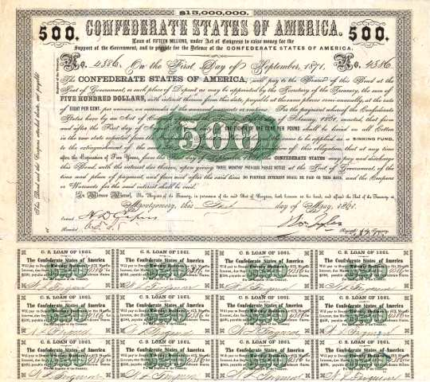
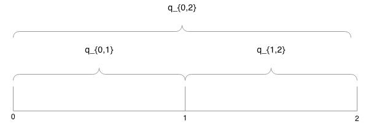

.. _bond_pricing_primer:

*************************
A Primer on Bond Pricing
*************************

What's a Bond?
==============

A bond is an I.O.U.  It is a piece of paper that promises

     *on date* :math:`t`, *I will pay you* :math:`y` *dollars.*

Of course things can be a little more complicated than this.

Non-Coupon and Coupon Bonds
---------------------------

Most bonds fall into one of two types:

1. *Non-coupon* or *pure discount* bonds state

    on (just one) date :math:`t`, I will pay you :math:`P` dollars.

2. *Coupon* bonds promise a stream of payments.

   +---------------+-----------------+
   |  On date      | I will pay you  | 
   +===============+=================+
   | :math:`t_1`   |  :math:`c`      |     
   +---------------+-----------------+
   | :math:`t_2`   |  :math:`c`      |
   +---------------+-----------------+
   |:math:`\vdots` |  :math:`\vdots` |
   +---------------+-----------------+
   | :math:`T`     |  :math:`c+P`    |
   +---------------+-----------------+

:math:`c` stands for *coupon*.

:math:`P` stands for *principal* or *par value* or *face value* of the bond.

Below is an example of coupon bond we will discuss later in the course.  This bond was issued to
finance the Confederacy during the Civil War.  

The top half of the bond is the principal. The promised principal payment is $500. 

Below are twelve coupon payments each promising to pay $20.

    **A Confederate Coupon Bond**

So the question we need to answer is how much would an investor in the early 1860s be willing to pay for 
this promise?

Present Value
-------------

A bond is a promise of a future payment by the bond's issuer to the bond's owner.  
In order to purchase this promise, an investor must give up something today.  How 
much should an investor be willing to give up today 
in exchange for a future payment (or series of future payments)?

To answer this question we must first another. Is a dollar today and dollar one year 
(365 days) from now worth the same amount today?  

Another way to phrase this question is: 
how much do you need to be compensated to postpone for one year one dollar's worth of consumption?

This compensation for postponing consumption is called the interest rate.

Note that you could take a dollar today, invest it at an interest rate :math:`r` and have :math:`$1 \times (1+r)` in a year.

In other words

.. math::
     \mbox{present value}  = \frac{\mbox{future value}}{1+r}

In this equation :math:`r` is often referred to as the *discount rate*.

If the discount rate is 6 percent, what is a dollar one year from now worth today?

.. math:: 
    \mbox{present value}  &=& \frac{\$1}{1+.06}  \\
                      &=&  \$0.943

What is a dollar two years from now worth today?

.. math::

    \mbox{present value}  &=& \frac{1}{1+.06} \times \frac{\$1}{1+.06}  \\
                      &=&  \frac{1}{1+.06} \times \$0.943 \\
                      &=&  \$0.890 

The Law of One Price or the Happy Meal Theorem [#]_ of Bond Pricing 
====================================================================

The theory of bond pricing we present is based on the assumption 
that any difference between the price of a bundle of payoffs and the 
sum of the prices of the individual payoffs within that bundle 
will be eliminated by market 
participants taking advantage of arbitrage opportunities.

Hence we can price a bundle of payoffs by stripping out each
component, pricing each component separately, and 
adding the individual components back up.

Consider a McDonald's "Happy Meal."  It consists of

   1. a burger, 
   2. fries, 
   3. a drink, and 
   4. a toy.  
   
The price of the Happy Meal should be exactly equal to the sum of the 

   1. price of the burger, 
   2. price of the fries, 
   3. price of the drink, and 
   4. price of the toy.  

Why?  

If the price of the happy meal is greater than the sum of the prices of the individual components, 
an enterprising soul could buy the four components, bundle them up and sell them at a slightly lower price 
than McDonald's.  This would be a profitable enterprise.

If the price of the happy meal is less than the sum of the prices of the individual components, 
an enterprising soul could buy the happy meal, strip out the four components, sell the four components and make a tidy profit.

Of course this silly example assumes unrealistically that transaction costs in the market for children's meals are minuscule. 
But the point is that we can 
price a bundle of goods by pricing each component individually and taking the sum.  This is our strategy for pricing bonds.

Relationship between bond prices and yields for zero-coupon bonds
==================================================================

In these Fiscal History lectures, we will want to compute the prices of coupon bonds
such as the Confederate bond shown at the top of this lecture.  To do so, we are going to think 
of a coupon bonds as a bundle of pure discount or zero coupon bonds.

To do this, we need to define some notation.  To keep things simple, assume that we live 
in world without money (so we don't have to think about inflation). In this world there is just 
a single good. Call this single good "beans."  In this world people eat beans, save beans, trade 
beans, and plant beans to produce more beans.

Define

.. math::
    q_{t,t+j} \equiv \mbox{price of one unit of time $t+j$ consumption at time t}

So :math:`q_{t,t+j}` is the number of beans (or fraction of beans) you would have to pay at time :math:`t` to purchase 
a promise to receive one bean at time :math:`t+j`.  This is known as the zero-coupon price.

Then define

.. math::          
    r_{t,t+j} \equiv \mbox{yield of a $j$-period $t+j$ pure discount (zero coupon) bond at time t}.
    
The zero-coupon yield is related to the zero-coupon price by:
         
.. math::          
    q_{t,t+j} &=& \exp(-j r_{t,t+j}) \approx \frac{1}{(1+r_{t,t+j})^j} 

Take logs of both sides

.. math::
    \log q_{t,t+j} &=& -j r_{t,t+j} \\
    r_{t,t+j} &=& - \frac{\log q_{t,t+j}}{j}

Consider a bond that at time :math:`t` promises to pay

      +---------+-----------+----------+---------+---------+---------+
      |  t      |    t+1    |   t+2    |   t+3   | ...     |  t+T    |
      +=========+===========+==========+=========+=========+=========+
      |   0     |     c     |    c     |    c    |  ...    |  P+c    |
      +---------+-----------+----------+---------+---------+---------+

The value (or price) of the bond at time :math:`t` is then sum of the 

|   1.  the coupon at date :math:`t+1`
|   2.  the coupon at date :math:`t+2`
|   3.  the coupon at date :math:`t+3`

:math:`\vdots`

|   T. the coupon at date :math:`t+T`
|   T+1. the principal payment at date :math:`t+T`

We write this summation as

.. math::
    V_t &=& c q_{t,t+1} + c q_{t,t+2} +  ... + c q_{t,t+T} + P q_{t,t+T} \\
        &=& c (q_{t,t+1} + q_{t,t+2} +  ... + q_{t,t+T}) + P q_{t,t+T}

Equivalently, we could write this summation as

.. math::
    V_t = \frac{c}{(1+r_{t,t+1})^1} + \frac{c}{(1+ r_{t,t+2})^2} +  ... + \frac{c}{(1+ r_{t,t+T})^T} + \frac{P}{(1+r_{t,t+T})^T}.

The value of this same bond at :math:`t+1`, after :math:`c` has been paid, is

.. math::
    V_{t+1}  = c (q_{t+1,t+2} + q_{t+1,t+3} +  ... + q_{t+1,t+T}) + P q_{t+1,t+T}

Evidently

.. math::
    V_t = q_{t,t+1} \left( c + V_{t+1} \right)

Forward Rates
==============

With no uncertainty, the law of one price asserts that

.. math::
    q_{t,t+j} = q_{t,t+1} q_{t+1,t+j}.

This equation states that there are two ways at time :math:`t` to buy one unit 
of consumption at :math:`t+j`. Either

     1. pay :math:`q_{t,t+j}` at time :math:`t`, or

     2. pay :math:`q_{t,t+1}` at time :math:`t` and :math:`q_{t+1,t+j}` at time :math:`t+1`

Consider a three period example. At time 0, suppose the investor wishes to purchase one unit of period 2 consumption. 
She has the option of 

     1. purchasing a two-period pure discount bond at the price :math:`q_{0,2}`
     
     2. purchasing a one-period pure discount bond at the price :math:`q_{0,1}`.  In period 1, the investor take 
     the proceeds and then purchases a second one-period pure discount bond for price :math:`q_{1,2}`.
     
Neither strategy should dominate the other.  In other words :math:`q_{0,2} = q_{0,1} q_{1,2}`.

Define

.. math::
    \tilde{q}^t_{t+1,t+j} \equiv \frac{q_{t,t+j}}{q_{t,t+1}}

as the *forward price* at :math:`t`.

In our three period example, 

.. math::
    \tilde{q}^0_{1,2} \equiv \frac{q_{0,2}}{q_{0,1}}.

With no uncertainty about future interest rates

.. math:: 
    \tilde{q}^t_{t+1,t+j} = q_{t+1,t+j}

When there is uncertainty, the two terms in this equation won't necessarily be equal.

A Three Period Coupon Bond Example
----------------------------------

Consider a bond issued at :math:`t=0`.  It is a riskless claim on the stream of payments

      +--------+---------+---------+
      |   0    |   1     |    2    |
      +========+=========+=========+ 
      |   0    |   c     |   c+P   |
      +--------+---------+---------+

The time :math:`t=0` price of the bond is

.. math::
    V_0 = q_{0,1} c + q_{0,2}(c+P)

After payment of the coupon, the price of the bond at time :math:`t=1` is

.. math::
    V_1 = q_{1,2}(c+P).
    
Therefore

.. math::
    V_0 &=&  q_{0,1} c + q_{0,1} V_1  \\
        &=&  q_{0,1} c + q_{0,1} q_{1,2}(c+P)

Yield to Maturity
=================

The yield to maturity (ytm) is the unique :math:`r` that satisfies

.. math::
    V = \frac{c}{(1+r)^1}  + \frac{c}{(1+r)^2} + \frac{c}{(1+r)^3} + ... + \frac{c+P}{(1+r)^T}

given :math:`V`, :math:`c`, :math:`P`, and :math:`T`.

The ytm usually can not be solved for by hand.  But we can solve for it using Excel.

It is sometimes just called the yield.

Value of a Call Option
=======================

During critical periods in the United States history, the federal government issued *callable bonds*.

A callable bond gives the government (or really the issuer of the bond) the right to purchase 
the bond at :math:`t=1` at a preset *strike price*. [#]_

For all the callable bonds we will study in these lectures, the strike price is 
the *par value* or *face value* of the bond, :math:`P`. 

Since the government does not have to repurchase the bond, the call feature of these bonds is an option.
The value of this call option at time 1 is :math:`\max(0,V_1 - P)`.

The government will want to exercise the call option if

.. math::
    P <  V_1 = q_{1,2}(c+P)

An interesting benchmark case is when :math:`V_1 = P`?

Solve equation

.. math::
    V_1 = P = q_{1,2}(c+P)

for :math:`q_{1,2}`

That is:

.. math::
    q_{1,2} = \frac{P}{c+P}

or

.. math::
    1+r_{1,2} \approx \frac{c+P}{P}

Question:  when is :math:`V_0 = V_1 = P`?

Throughout U.S. history we often see that Congress is reluctant to issue bonds selling at less than :math:`P`.

Extend the Example: Interest rate risk
--------------------------------------

In this example, assume that the future payouts are known for certain; however, future interest rates are uncertain.

Assume three time periods: :math:`0`, :math:`1`, and :math:`2`.

.. math::
    q_{0,1}, \; \; q_{1,2}(H), \; \; q_{1,2}(L) \; \; \mbox{ where $q_{1,2}(H) > q_{1,2}(L)$}

Assume 

    * :math:`q_{1,2}(H)` occurs with probability :math:`\pi_0`, and

    * :math:`q_{1,2}(L)` occurs with probability :math:`1-\pi_0`.

We are assuming a simple "expectations theory" of the term structure

.. math::
    q_{0,2} &=& q_{0,1}(\pi_0 q_{1,2}(H) + (1-\pi_0) q_{1,2}(L)) \\
    \frac{q_{0,2}}{q_{0,1}} &\equiv& \tilde{q}^0_{1,2} = \pi_0 q_{1,2}(H) + (1-\pi_0) q_{1,2}(L)

:math:`\tilde{q}^0_{1,2}` is the *forward price*.  It is an average of the two possible prices next period

In this example, we are making no adjutment for risk.  Fancier theories that you will learn in a financial economics
course will adjust for risk the right hand side of this equation.

   - whose :math:`\pi_0`? (rational expectations)

Similarly

.. math::
     \tilde{r}^0_{1,2} = \pi_0 r_{1,2}(L) + (1-\pi_0) r_{1,2}(H)

Note that in this equation we flip :math:`H` and :math:`L` because high bond prices mean low interest rates.

Value of a Call Option
----------------------

At :math:`t=0`, you purchase the right to buy the bond at :math:`t=1` at a price :math:`P`.

Assume that

.. math::
     q_{1,2}(H) > q_{1,2}(L)

and

.. math::
     q_{1,2}(H)(c+P) > P > q_{1,2}(L)(c+P).

If state :math:`H` occurs the time :math:`1` value of the call is

.. math::
     V_1^{call} = \max(0,q_{1,2}(H)(c+P) -P) > 0.

But if state :math:`L` occurs the time :math:`1` value of the call is

.. math::
     V_1^{call} = \max(0, q_{1,2}(L)(c+P) -P) = 0.

Therefore, the time :math:`0` value of the call is

.. math::
     V_0^{call} = q_{0,1} \left[ \pi_0(q_{1,2}(H)(c+P) -P) \right]

Example
-------

Example: With constant interest rates satisfying the "Congress wishful thinking condition"

.. math::
     P = q_{t,t+1}(c+P)

or

.. math::
     q_{t,t+1} = \frac{P}{c+P} \; \mbox{ for all $t$}

then the value of the call is zero.

Hence

.. math::
     q_{1,2}(H) = q_{1,2}(L) = \frac{P}{P+c}

Pricing a Callable Bond
-----------------------

Consider

.. math::
    q_{1,2}(H)  > \frac{P}{P+c} > q_{1,2}(L)

Value of a non-callable bond

.. math::
    V_0 = q_{0,1} c + q_{0,2}(c+P)

Suppose the government issues a two period bond that is callable in period 1 at par.

A callable bond can be decomposed into two parts
   1. non-callable bond
   2. call option

When the government issues a callable bond, it sells part 1 and buys part 2.

By the Happy Meal Theorem, the value of a callable bond of the callable bond is the value of a noncallable bond
minus the value of the call option.

.. math::
    V_0 - V_0^{call}

Example: 20 Year Coupon Bond
============================

Suppose that this year (January 1, 2014) you purchase a 6\% percent 2034 U.S. Treasury bond with a face value of \$100.

     +--------+----------+--------+---------+------+-------+------+
     |  2014  |   2015   |  2016  |  2017   | ...  | 2033  | 2034 |
     +========+==========+========+=========+======+=======+======+
     |   0    |    6     |   6    |   6     |  ... | 6     | 106  |
     +--------+----------+--------+---------+------+-------+------+

No uncertainty

Apply the Happy Meal Theorem

.. math::
    V_{2014} &=& q_{2014,2015} C + q_{2014,2016} C + q_{2014,2017} C + q_{2014,2034} ( C + P)

Assume a constant interest rate

A flat term structure

.. math::
     r_{2014,2015} = r_{2015,2016} = r_{2016,2017} = r_{2017,2018} ... = \bar{r}

So :math:`\bar{r}` is the yield-to-maturity or YTM.

Use Excel to do the valuations
------------------------------

Let EXCEL do the calculations for us

 First set :math:`\bar{r}=.06`

.. figure:: _static/images/20_yr_bond_example_6.jpg
    :scale: 100%
    :align: center

Second set :math:`\bar{r}=.03`

.. figure:: _static/images/20_yr_bond_example_3.jpg
    :scale: 100%
    :align: center

Finally set :math:`\bar{r} =.09`

.. figure:: _static/images/20_yr_bond_example_9.jpg
    :scale: 100%
    :align: center

If a bond's coupon rate is
    - less than its YTM, then the bond is selling at a *discount*.
    - more than its YTM, then the bond is selling at a *premium*.
    - equal to its YTM, then the bond is selling at *par*.

One Type of Risk:  Interest Rate Risk
-------------------------------------

Suppose that the (constant) interest rate is 6 percent

Five years from now, in 2019, (after we receive the 2019 coupon payment), there is
   - :math:`\pi` chance the interest rate will fall to 3\% from 2019 on
   - :math:`1-\pi` chance the interest rate will rise to 9\% from 2019 on

How does this risk affect our bond pricing?

   - Assumption:  we are risk-neutral.

   - We need to price both possibilities.
 
Work Backwards

What is our 20 year, \$100 face value, 6\% coupon, bond worth in 2019?
  
    * CASE I:  Interest rate falls to 3 percent

    .. math::
            V_{2019}^{.03} = \sum_{t=1}^{15}\frac{C}{(1+0.03)^t} + \frac{P}{(1+.03)^{15}}

    * CASE II: Interest rate rises to 9 percent

     .. math::
            V_{2019}^{.09} = \sum_{t=1}^{15}\frac{C}{(1+0.09)^t} + \frac{P}{(1+.09)^{15}}

.. figure:: _static/images/20_yr_bond_example_var_int.jpg
    :scale: 100%
    :align: center

So what is our bond worth today in 2014?

.. math::
      V_{2014} =  \sum_{t=1}^{5}\frac{C}{(1+0.06)^t} + \pi \frac{V_{2019}^{.03}}{(1+.06)^5} + (1-\pi) \frac{V_{2019}^{.09}}{(1+.06)^5}

A Call Option
-------------

Consider the following contract: Today (in 2014) I sell you the right to purchase this bond in year 2019 for $100.

   -You don't have to purchase the bond.  It is an option.

How much is this option worth?

    - Again, work backwards.  In 2019, consider both cases

         1. CASE I:  :math:`\max(0, V_{2019}^{.03} - 100)`

         2. CASE II: :math:`\max(0, V_{2019}^{.09} - 100)`

In 2019

.. math::
      V_{2019}^{call} = \pi \max(0, V_{2019}^{.03} - 100) + (1-\pi) \max(0, V_{2019}^{.09}- 100)

In 2014

.. math::
      V_{2014}^{call}  = \frac{V_{2019}^{call}}{(1+.06)^5}

What's the price of a 5-20 bond?
--------------------------------

Consider a 20 year coupon bond that callable at par by the Treasury after five years.

Happy Meal Theorem

.. math::
     V_{2014} - V_{2014}^{call}

If a callable bond always sells for less than a non-callable bond, why would a government ever issue a callable bond?

Using the Government Budget Constraint to Price Government Debt
===============================================================

The price of a bond is the discounted present value of the stream of promised payments

We could think of the government budget constraint much the same way.  Recall we can rewrite the government budget constraint as:

.. math::
       B_{t}  =   \sum_{j=1}^{\infty} \left(\frac{1}{1+r}\right)^{j}(T_{t+j} - G_{t+j})

Up until now, we have assumed the future paths of :math:`T` and :math:`G` will have to adjust to satisfy the 
current value of :math:`B_t`.

But what if the expected value of

   .. math::
       \sum_{j=1}^{\infty} \left(\frac{1}{1+r}\right)^{j}(T_{t+j} - G_{t+j})

is less than the face value of the current stock of debt?

   * If future :math:`T` s and :math:`G` s are constrained, bond prices will adjust.

So is the government budget constraint a constraint?  Or is it a bond pricing formula?

Holding Period Returns
----------------------

Suppose you buy a bond at period :math:`t` a price :math:`V_t`, hold it one period, and sell it at 
price :math:`V_{t+1}`.  What is your return?

     * In period :math:`t+1` you receive the coupon payment and the sales price.

     * So the one-period ex-post *holding period return* for a bond is

     .. math::
           1+r_{t,t+1} = \frac{C + V_{t+1}}{V_t}

Recorded Government Interest Payments
======================================

What the Bureau of the Public Debt reports as its nominal interest payments
    - discounts Treasury bills
    - add up the coupons on notes and bonds.

This number answers the question 

    *how many dollars must the Treasury devote to paying coupons on this period's outstanding government bonds while rolling over the nominal stock of treasury bills?*  

But note that this number leaves out capital gains and losses 
on Treasury notes and bonds.  This number does not answer the question  

    *what return did government bond holders receive?*

Comparison Between Official Interest Payments and Returns to Bondholders
------------------------------------------------------------------------

Following [Eisner1986]_ and [Bohn1992]_ we take the government budget constraint 

.. math::
        B_{t} =  B_{t-1} + r B_{t-1} + G_t + TR_t - T_t

and impute the return on the debt via

.. math::
        r =  \frac{B_t - B_{t-1} - G_t - TR_t + T_t}{B_{t-1}}.

If :math:`B` is measured by the market price of the debt, this value of :math:`r` will be 
the one-period holding period
return on the debt. 

.. figure:: _static/figures/cof_returns_gdpdef.png
    :scale: 60%
    :align: center

    **Reported Interest Payments and Holding Period Returns** 

In the figure above, we compare the federal government's reported interest payments
with the holding period return on the debt imputed by the government budget constraint for the post-World War II period.

The blue line is the computed holding period return on the debt 
implied by the government budget constraint. 
The red line is the officially reported interest 
payments. Both series are reported as percentages of the 
total market value of publicly-held Treasury debt. 
The black line is the red line minus the inflation rate.

     +------------------------------------+----------+----------+
     | Variable                           |  Mean    | Std Dev  |
     +====================================+==========+==========+
     | Official Interest/Debt             |   5.20   |    2.54  |
     +------------------------------------+----------+----------+
     | Inflation                          |   3.73   |    2.67  |
     +------------------------------------+----------+----------+
     | Official Interest/Debt - inflation |   1.47   |    3.31  |
     +------------------------------------+----------+----------+
     | Real Return on Marketable Debt     |   1.63   |    4.86  |
     +------------------------------------+----------+----------+

     **Means and Standard Deviations of Returns**

Imputed from the government budget constraint, the holding period return on US Treasury debt is lower on average 
and considerably more volatile 
than the official reported interest costs. The official interest payments average 5.2% of the debt while 
our measure of the real return on the debt averages 1.6%. If we subtract the inflation rate from the 
officially reported interest payments (the black line), the two series have roughly the same mean (1.5 versus 1.6).

In contrast to the officially reported net interest payment series, our measure of the return on government debt 
from the government budget constraint demonstrates some striking outcomes.

    1. There were large negative returns immediately after World War II as inflation surged with the lifting of price controls.
    
    2. During the early 1980s, when, perhaps unexpectedly, Federal Reserve Chairman Paul Volcker brought down inflation, 
       bondholders – particularly long-term bond holders – received large positive returns. Many 
       who point to the 1970s as a time during which the US was able to pay low returns to its 
       creditors through inflation often fail to acknowledge the large returns many of those same 
       creditors received when inflation fell in the early 1980s.

    3. Annual real returns became considerably more volatile in the two and half decades after 
       1980 – a period of low volatility in GDP growth often described as the Great Moderation.

Does this Accounting Issue Matter?
----------------------------------

Reported interest payments on the debt are not the :math:`r B_{t}` in the government budget constraint.  But is this a big deal?

The Treasury

    1. reports the par value rather than the market value of its debt, and
    2. typically sets the coupon rate so that at auction, bonds sell near par.

In this case the yield to maturity equals the coupon rate, and any difference between the par value and the market value 
of the debt will be small.

Big differences between the par value and market value will emerge when there are large capital gains and losses 
(perhaps due to changes in inflation).  As we will see this occured during the War of 1812

For further reading on the official interest payments and the returns to government bondholders see [Hall-Sargent2011]_.

Footnotes
---------

.. [#]  `John Cochrane`_ introduced us to the term "The Happy Meal Theorem."

.. _John Cochrane: http://faculty.chicagobooth.edu/john.cochrane/

.. [#] A typical home mortgage is an example of a callable bond.  For most mortgages, the issuer (i.e. the homeowner) 
       has the right to prepay or call the mortgage at any time.

References
----------

.. [Bohn1992] Bohn, Henning. 1992. "Budget Deficits and
              Government Accounting." *Carnegie-Rochester Conference Series on Public Policy*,
              37: 1-83.

.. [Eisner1986] Eisner, Robert. 1986. *How Real is the Federal Deficit?*
                New York: The Free Press.

.. [Hall-Sargent2011] Hall, George J. and Thomas J. Sargent 2011. "Interest Rate Risk and Other 
                      Determinants of Post WW-II U.S. Government Debt/GDP Dynamics." 
                      *American Economic Journal: Macroeconomics*, 3: 192-214.
