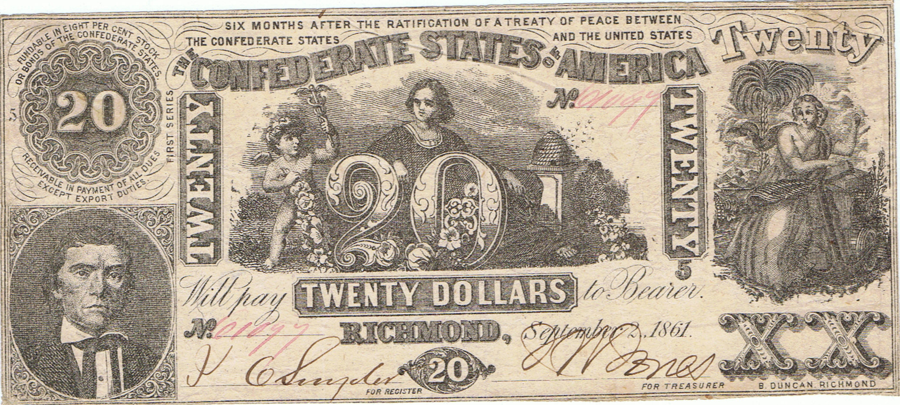
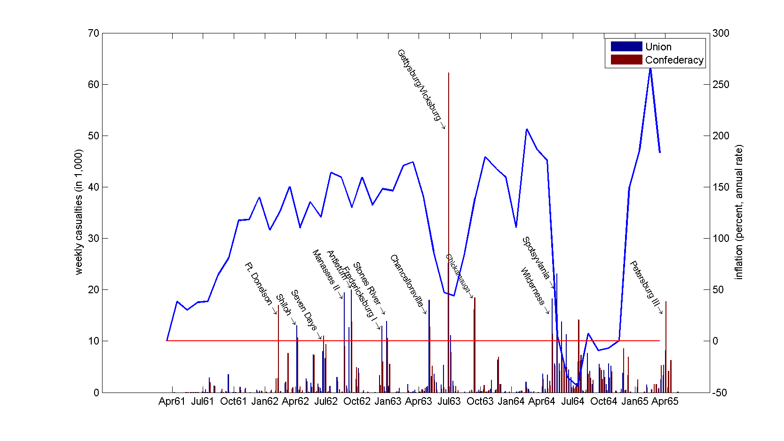
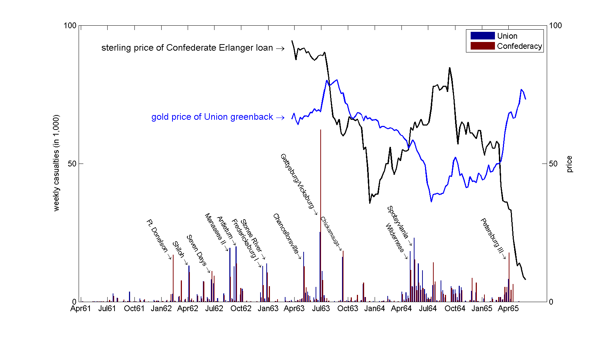

.. _confederacy:

***************
The Confederacy
***************

Index
=====

1. Confederate Constitution

2. Expenditures

3. Receipts

4. Borrowing

5. Using Prices to Infer Expectations

First Some Caveats
------------------

* Many books written on Confederate finance

     * None apply

     .. math::

            B_{t}  =  B_{t-1} + r B_{t-1} + G_t - T_t  - \frac{M_t - M_{t-1}}{P_t}

* Eight Treasury reports

    * war ends in April 1865

    * last report ends October 1864

* Still need to construct consistent time series for debt, interest payments, seignorage ...

The Confederate Constitution
----------------------------

Confederate States of America (CSA) used the United States Constitution as a template for their own.

     * more limits on the power of the central government.

     * for example, the United States Constitution states:

.. epigraph::

     The Congress shall have Power

.. epigraph::

      To lay and collect Taxes, Duties, Imposts, and 
      to pay the Debts and provide for the common Defence and 
      general Welfare of the United States; but all Duties, Imposts 
      and Excises shall be uniform throughout the United States.

The Confederate Constitution takes out the general welfare clause.

     * The same clause in the Confederate Constitution reads:

.. epigraph::

      The Congress shall have Power

.. epigraph::

      To lay and collect Taxes, Duties, Imposts and Excises, for revenue necessary to pay the Debts, provide for the common Defence;
      and carry on the government of the Confederate States; but no bounties shall be granted from the treasury, nor shall any duties,
      or taxes, or importation from foreign nations be laid to promote or foster any branch of industry; and all Duties, Imposts and 
      Excises shall be uniform throughout the Confederate States.

Asymmetric War
--------------

* If Confederacy wins -- only needs Union to quit

    * Confederacy survive, debt likely **will be** paid

    * Union will survive

* If Union Wins

    * Confederacy fails, debt most likely **won't be** paid

    * Union will survive

* Recall

.. math::

     B_{t} + \frac{M_t}{P_t} = \sum_{j=1}^{\infty} \left(\frac{1}{1+r}\right)^{j}(T_{t+j} -G_{t+j})

Confederate Expenditures
------------------------

* Almost all spending related to the war

* Reports combine coupon and principal payments into "payments on the debt"

      * later in war, lots of old debt paid off with new debt

* CAUTION: amounts are nominal, periods are not of equal length

     +---------------------+---------+--------+----------------+------------+----------+
     | Period              |   War   | Navy   | Civil \& Misc  | Interest   | Total    |
     +=====================+=========+========+================+============+==========+
     | Feb 1861 - Nov 1861 |\$66.0   |  \$2.9 | \$1.7          |   ??       |  \$70.6  |
     +---------------------+---------+--------+----------------+------------+----------+
     | Nov 1861 - Feb 1862 |  86.8   |  4.7   | 3.3            | ??         |  94.8    |
     +---------------------+---------+--------+----------------+------------+----------+
     | Feb 1862 - Jul 1862 | 145.5   |  7.0   | 5.2            |   ??       | 157.7    |
     +---------------------+---------+--------+----------------+------------+----------+
     | Aug 1862 - Dec 1862 | 195.5   | 13.6   | 8.5            | ??         | 217.6    |
     +---------------------+---------+--------+----------------+------------+----------+
     | Jan 1863 - Sep 1863 | 378.0   | 38.4   | 11.7           | ??         | 428.1    |
     +---------------------+---------+--------+----------------+------------+----------+
     | Oct 1863 - Mar 1864 | 238.6   | 10.9   | 5.6            | ??         |255.1     |
     +---------------------+---------+--------+----------------+------------+----------+
     | Apr 1864 - Oct 1864 |  246.4  | 15.6   | 10.5           |\$10.8      | 272.5    |
     +---------------------+---------+--------+----------------+------------+----------+

     **Confederate Expenditures**

In millions of nominal Confederate dollars.

Confederate Revenue
-------------------

* Initially CSA expected short, inexpensive war

* On May 10, 1861 Secretary of the Confederate Treasury, Christopher Memminger, recommends a Gallatin-policy

     * finance war with borrowing

     * property taxes to cover the interest

            * slave holders had most to gain from war

            * State collection mechanisms already in place
   
     * Almost no revenue came in from this

            * states refused to participate

* Little in customs revenue and export duties

     * Union blockade

     * cotton embargo

* Internal taxes

     * income tax, sales taxes, profit taxes

     * sequestration

         * confiscation of land and goods owned by Northerners

* Little revenue

     * Union troops occupied territories

     * tax collectors poorly paid, easily evaded

    +---------------------+----------------------------+-----------------+-------+
    | Period              |   Customs \& Export Duties |  Internal Taxes | Total |
    +---------------------+----------------------------+-----------------+-------+
    | Feb 1861 - Nov 1861 |  \$0.22                    |  \$0.44         |\$0.66 |
    +---------------------+----------------------------+-----------------+-------+
    | Nov 1861 - Feb 1862 |  0.32                      |  0.19           |0.52   |
    +---------------------+----------------------------+-----------------+-------+
    | Feb 1862 - Jul 1862 |  0.17                      | 11.49           |11.66  |
    +---------------------+----------------------------+-----------------+-------+
    | Aug 1862 - Dec 1862 |  0.50                      | 13.88           |14.39  |
    +---------------------+----------------------------+-----------------+-------+
    | Jan 1863 - Sep 1863 |  0.94                      | 30.65           |31.59  |
    +---------------------+----------------------------+-----------------+-------+
    | Oct 1863 - Mar 1864 |  0.45                      | 112.11          |112.56 |
    +---------------------+----------------------------+-----------------+-------+
    | Apr 1864 - Oct 1864 |     0.06                   |  85.85          | 85.91 |
    +---------------------+----------------------------+-----------------+-------+

   **Confederate Receipts**

In millions of nominal Confederate dollars.

    +---------------------+------------------------+--------+-----------+
    | Period              |   Government Spending  |  Taxes | Primary   |
    +---------------------+------------------------+--------+-----------+
    | Feb 1861 - Nov 1861 |  \$70.6                | \$0.7  |  \$69.9   |
    +---------------------+------------------------+--------+-----------+
    | Nov 1861 - Feb 1862 |   94.8                 |  0.5   |  94.3     |
    +---------------------+------------------------+--------+-----------+
    | Feb 1862 - Jul 1862 |  157.7                 | 11.7   |  146.0    |
    +---------------------+------------------------+--------+-----------+
    | Aug 1862 - Dec 1862 |  217.6                 | 14.4   |  203.2    |
    +---------------------+------------------------+--------+-----------+
    | Jan 1863 - Sep 1863 |  428.1                 | 31.6   |  396.5    |
    +---------------------+------------------------+--------+-----------+
    | Oct 1863 - Mar 1864 |  255.1                 | 112.6  |  142.5    |
    +---------------------+------------------------+--------+-----------+
    | Apr 1864 - Oct 1864 |  272.5                 |  85.9  |  186.6    |
    +---------------------+------------------------+--------+-----------+

    **Confederate Deficits**

In millions of nominal Confederate dollars.

Confederate Borrowing
---------------------

* Southern borrowers were not suppose to repay Northern lenders

      * many continued to repay.  Why?

* Issued both bonds and currency

     * placed loans both domestically and with Europe

     * South mostly agricultural, supply of loans tied to farming cycle

* Currency finance

     * payable in species after the peace

     * rapid inflation

     * inflation moved with battlefield success

    **Confederate Dollars**
    
    +------+-------------+----------------+--------+
    |      |             |   Confederate  |  Price |
    +      +             +                +        +
    |      |             |   Dollars      |  Level |
    +------+-------------+----------------+--------+
    | 1861 |             |                |        |
    +------+-------------+----------------+--------+
    |      | January     |                |  100   |
    +------+-------------+----------------+--------+
    |      | April       |                |  130   |
    +------+-------------+----------------+--------+
    |      | June        |  \$1.1         |  130   |
    +------+-------------+----------------+--------+
    |      | October     |   24.5         |  180   |
    +------+-------------+----------------+--------+
    | 1862 |             |                |        |  
    +------+-------------+----------------+--------+
    |      | January     |   74.6         |  250   |
    +------+-------------+----------------+--------+
    |      | April       |  131.0         |  300   |
    +------+-------------+----------------+--------+
    |      | June        |  166.1         |  330   |
    +------+-------------+----------------+--------+
    |      | October     |  287.3         |  500   |
    +------+-------------+----------------+--------+
    | 1863 |             |                |        |
    +------+-------------+----------------+--------+
    |      | January     |  410.5         |  690   |
    +------+-------------+----------------+--------+
    |      | April       |  561.7         |  870   |
    +------+-------------+----------------+--------+
    |      | June        |  637.3         |  960   |
    +------+-------------+----------------+--------+
    |      | October     |  792.4         | 1130   |
    +------+-------------+----------------+--------+
    | 1864 |             |                |        |
    +------+-------------+----------------+--------+
    |      | January     |  826.8         | 1160   |
    +------+-------------+----------------+--------+

    **Confederate Dollars**

    In millions of nominal Confederate dollars.

What determines the price level?
--------------------------------

* Quantity theory of money?

.. math::

   Money \times Velocity &=& Price \times Output \\
   M     \times  V       &=& P     \times   Y    

* Expected discounted present value of future surpluses?

.. math::

     B_{t} + \frac{M_t}{P_t} =   \sum_{j=1}^{\infty} \left(\frac{1}{1+r}\right)^{j}(T_{t+j} -G_{t+j})

    **Casualties and Confederate Inflation**

    **Casualties, Confederate Bond Prices, and Union Greenbacks**

End of War
----------

* Others estimate Confederate revenues were

     * 5\% from taxes (20\% for the Union)

     * 60\% seignorage

     * 30\% bond sales

     * 5\% other sources

* What is the optimal share from taxes?

* Confederacy ended the war with

     * \$712 million in long-term interest-bearing debt

     * \$1,554 million in short-term and non-interest bering debt

* Any hopes of Union assumption of these debts?

