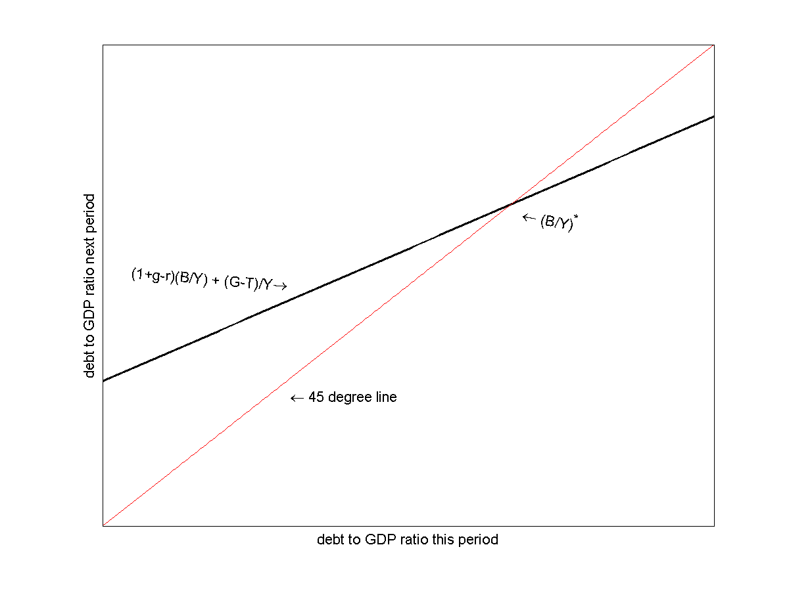
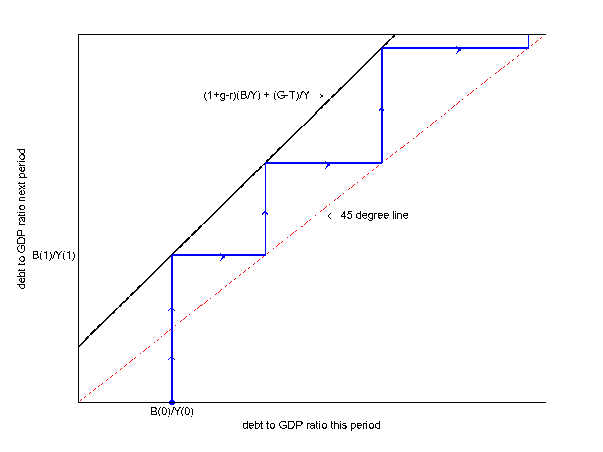

.. _debt_to_GDP:

*********************
The Debt to GDP Ratio
*********************

Suppose your credit card balance is $20,000.  Is this a big balance?

Well it depends

  * If your annual income is $15,000, then yes.

  * If your annual income is $1,500,000, then no.

It also depends on how fast your income is growing.

So we might be interested in the ratio of debt-to-income.  Let's denote income by :math:`Y`, and the ratio of
debt-to-income by :math:`\frac{B}{Y}`.

We plotted the ratio of U.S. government debt to GDP in first lecture.

.. figure:: _static/figures/long_total_fed_debt_to_gdp.png
    :scale: 60%
    :align: center

    **Federal Debt to GDP Ratio**

The Evolution of the Debt to GDP Ratio
======================================

Ignore seignorage for now and set transfer to zero. So we can write the government budget constraint as

.. math::
   B_{t}  &=&  B_{t-1} + r B_{t-1} + G_t - T_t \\
   &=&  (1+r) B_{t-1} + G_t - T_t

Divide both sides of the equation by current income :math:`Y_t`

.. math::
    \frac{B_{t}}{Y_t}  &=&  (1+r) \frac{B_{t-1}}{Y_t} + \frac{G_t - T_t}{Y_t} \\
    &=&  (1+r) \frac{B_{t-1}}{Y_t}\frac{Y_{t-1}}{Y_{t-1}} + \frac{G_t - T_t}{Y_t} \\
    &=&  (1+r) \frac{B_{t-1}}{Y_{t-1}}\frac{Y_{t-1}}{Y_{t}} + \frac{G_t - T_t}{Y_t}

Let :math:`g` denote the percentage change in :math:`Y`

.. math::
   g = \frac{Y_t}{Y_{t-1}} - 1

so

.. math::
   \frac{Y_{t-1}}{Y_t} = \frac{1}{1+g}

So we can write

.. math::
    \frac{B_{t}}{Y_t} &=&  \frac{(1+r)}{(1+g)} \frac{B_{t-1}}{Y_{t-1}} + \frac{G_t - T_t}{Y_t} \\
                      &\approx&  (1+r-g) \frac{B_{t-1}}{Y_{t-1}} + \frac{G_t - T_t}{Y_t} 

This equation characterizes the evolution of the debt-to-GDP ratio.  The evolution depends on the interest rate, :math:`r`,
the growth rate of GDP, :math:`g`, and the primary deficit :math:`G-T`.  The higher the interest rate,
the more resources the government must devote toward compensating its creditors, hence the larger will be
next period's value of :math:`\frac{B}{Y}`.  In contract a larger value of :math:`g` implies that the denominator
is growing faster diminishing next period's value of   The higher the primary deficit the
larger the necessary increase in the debt and the larger the value of next period's :math:`\frac{B}{Y}`.

Sustainability 
===============

Most countries have positive debt-to-GDP ratios.  In the short-term, it is often no
big deal if this ratio rises.  But can debt-to-GDP ratios rise forever?

In other words, which paths of :math:`B/Y` are stable? which are explosive?

To keep the math simple, assume :math:`G` and :math:`T` grow at rate :math:`g`
so that :math:`\frac{G_t - T_t}{Y_t}` is a constant.

.. math::
   \frac{B_{t}}{Y_t} =  (1+r-g) \frac{B_{t-1}}{Y_{t-1}} + \frac{G - T}{Y}

It is relatively simple to study this relationship in EXCEL.

Consider the following case.  Set

  * :math:`g`, the growth rate of :math:`Y`, to 3 percent
  * :math:`r`, the interest rate, to 2 percent
  * :math:`\frac{G - T}{Y}`, the ratio of the primary deficit to GDP, to 5 percent, and
  * the initial value of the debt to GDP ratio :math:`\frac{B_0}{Y_0}` to 10 percent.

We can then simulate the path of the debt-to-GDP.

.. figure:: _static/images/excel_screenshot_BY_lom1.jpg
    :scale: 90%
    :align: center

We see that the debt-to-GDP ratio is growing each period.  Does this mean it will grow forever?

Let's extend the simulation for 500 periods.  Then we plot the 500 simulations of :math:`\frac{B}{Y}` computed in column B.

.. figure:: _static/images/b_y_simulation1.jpg
    :scale: 90%
    :align: center

We see that the debt-to-GDP ratio grows, but that this growth diminishes as the series approaches 5.

Now let's change this exercise by raising the interest rate from 2 percent to 4 percent holding everything else fixed.

.. figure:: _static/images/excel_screenshot_BY_lom2.jpg
    :scale: 80%
    :align: center

In this case, the debt-to-GDP explodes toward infinity.

To download this EXCEL file, click here_.

.. _here: http://people.brandeis.edu/~ghall/_build/programs/law_of_motion_for_BY.xlsx

So what is going on?  Let's go back to the algebra.

Consider two cases

1. :math:`g>r` (i.e. the growth rate of GDP exceeds the interest rate)

2. :math:`g \le r` (i.e. the growth rate of GDP is less than the interest rate)

Let's plot the law of motion for the debt-to-GDP ratio for case 1.

In this figure, the thick black curve represents the right hand side of
the law of motion and the thin red line corresponds to the 45 degree line.  At every point
on the 45 degree line, :math:`\frac{B_t}{Y_t} =\frac{B_t}{Y_t}`.

These two line intersect once with the black line crossing the 45 degree line only once from above.

This occurs because

    1. the y-intercept of the law of motion, the primary deficit to GDP ratio, is positive, and
    2. the slope of the equation :math:`(1-g+r)` is less than one (i.e. the slope of the 45 degree line)

The intersection of these two lines gives the *steady-state* value of :math:`\frac{B}{Y}`.
At this steady state, :math:`\frac{B}{Y}` remains constant.

The steady state corresponds to:

.. math::
   \frac{B}{Y} &=&  (1+r-g) \frac{B}{Y} + \frac{G - T}{Y} \\
  (g-r) \frac{B}{Y} &=& \frac{G - T}{Y} \\
  \frac{B}{Y} &=& \frac{1}{g-r} \frac{G - T}{Y}

Now let's plot the law of motion for debt-to-GDP ratio for case 2.

As in the previous figure, the thick black curve represents the right hand side of
the law of motion and the thin red line corresponded to the 45 degree line.

In this case, the slope of the law of motion is greater than one, so the two curve do not intersect.
Thus no steady state exists.

The two take-aways from this exercise are

  1.  If a country grows faster than its interest rate (i.e if g > r), its debt-to-GDP ratio will not blow up.

  2.  Small changes in the interest rate and/or growth rate of GDP can have a dramtic impact on the path of the debt-to-GDP ratio.

A government can sustain persistent deficits as long as growth
in output is greater than the real interest rate.
A country does not necessarily need a balanced budget in order to insure its debt-to-GDP rate is sustainable.
This is not to say that the debt-to-GDP will not be quite high.  In our Excel example, the steady-state debt-to-GDP
was 500 percent.  But as long as :math:`g > r`, the debt-to-GDP will remain finite.

Debt crises occur when a country switches from having :math:`g > r` to having :math:`g < r`.

Since World War II, the U.S. has generally grown faster than the interest rate the government has faced. On average the U.S. has
grown about 3.3 percent per year.  The average interest rate on government debt has been about 1.6 percent.

