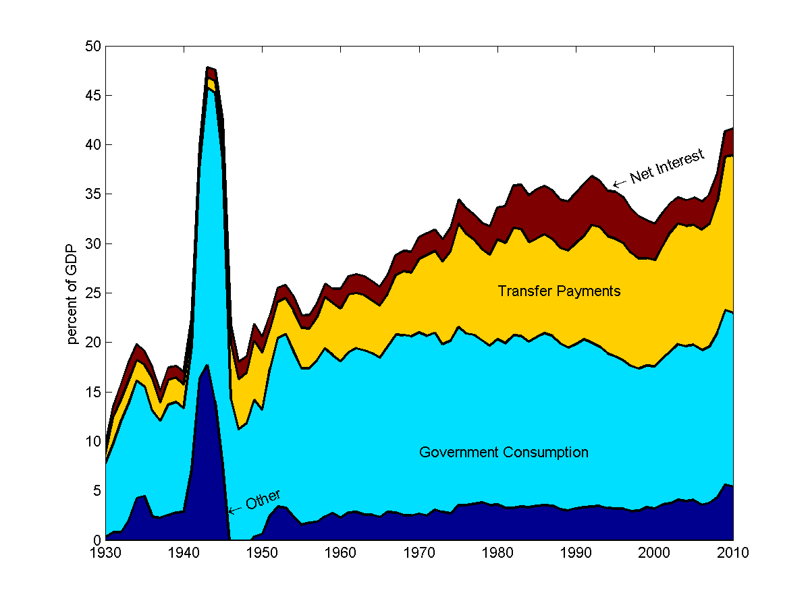
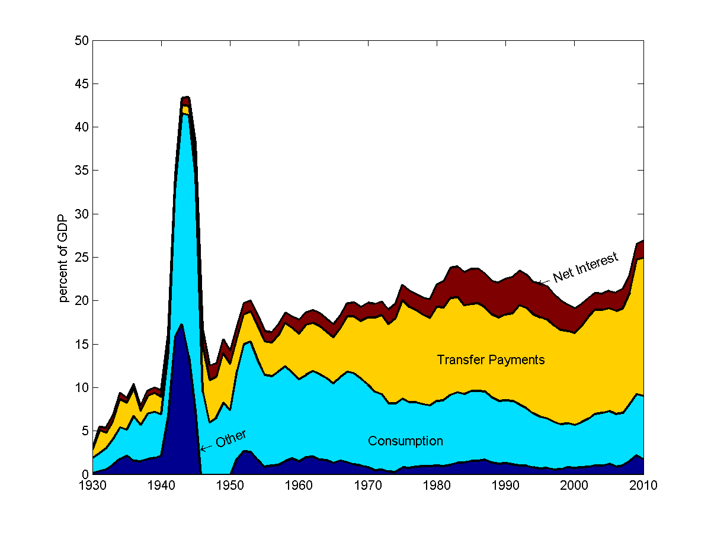
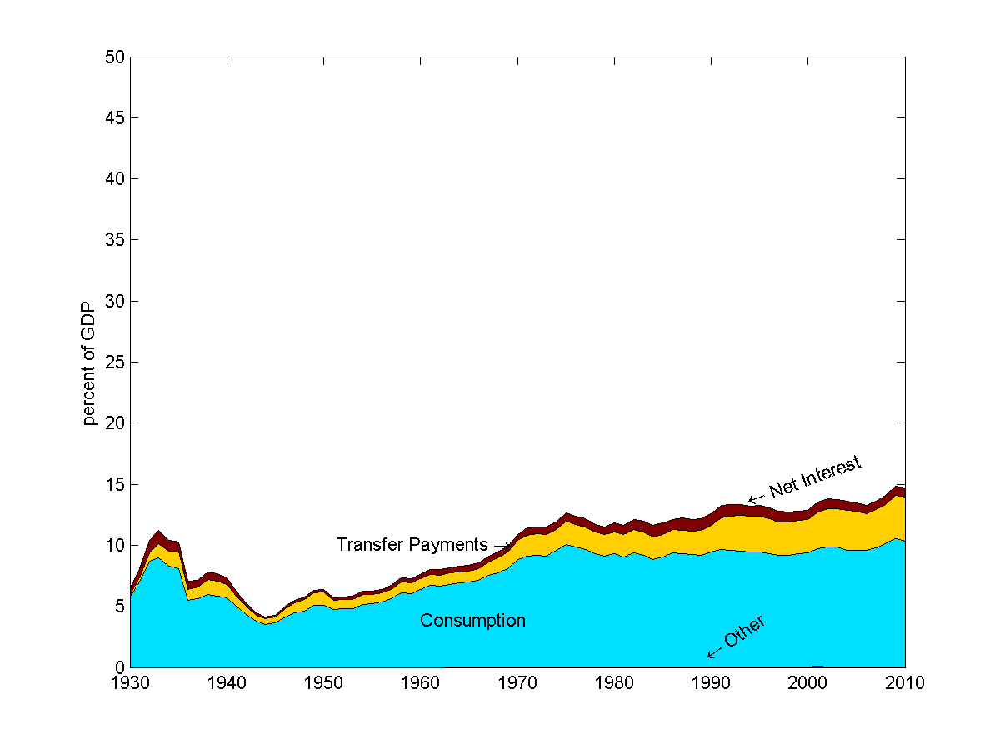
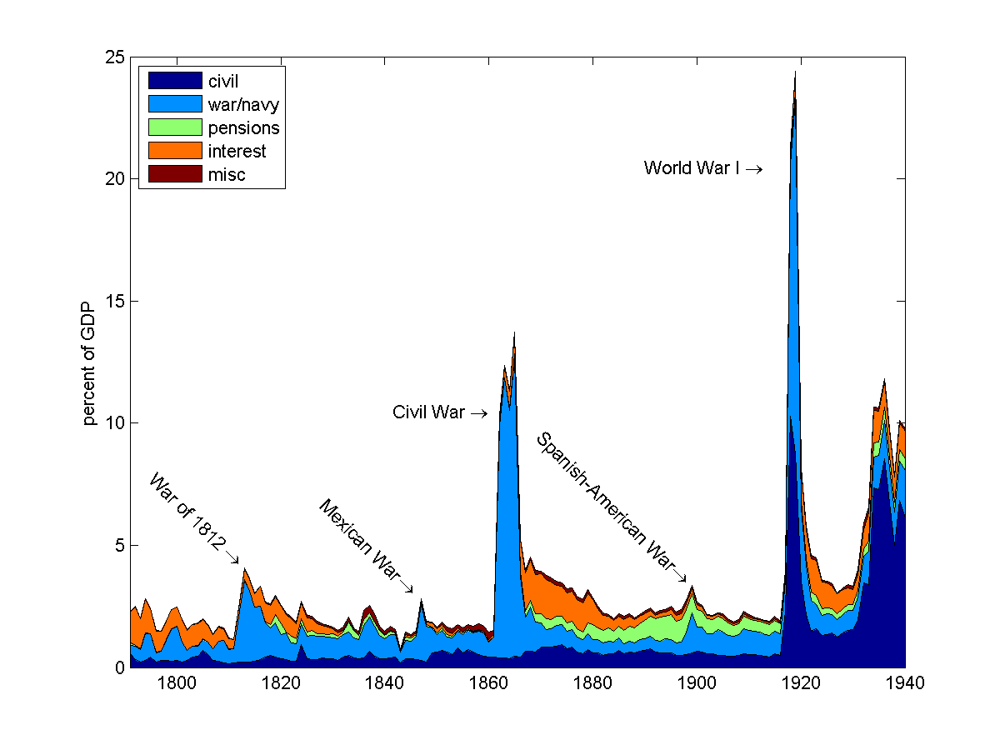
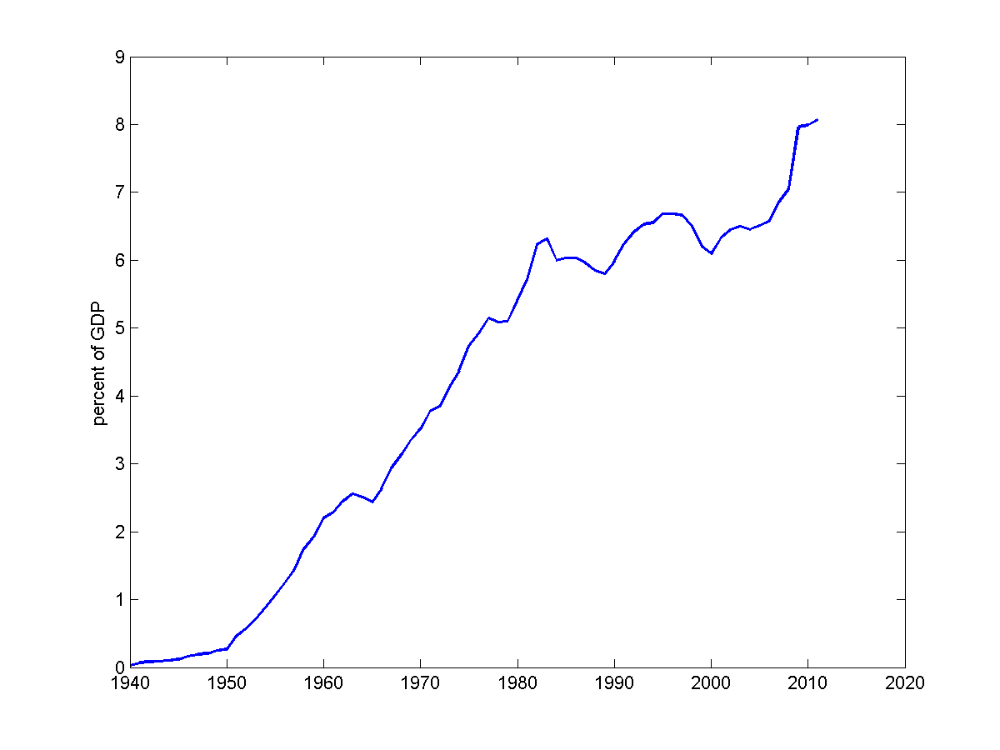
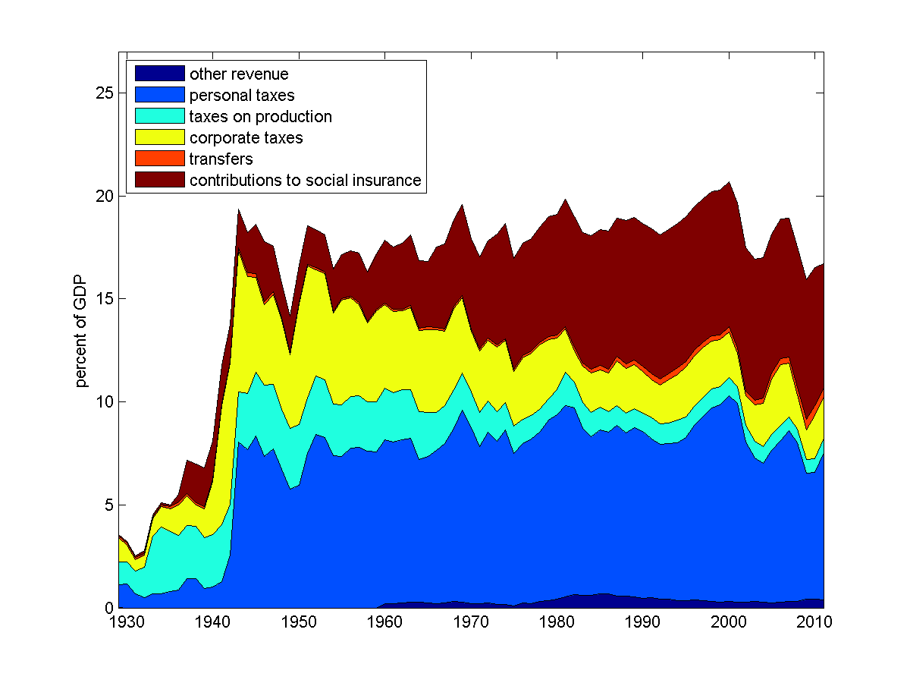
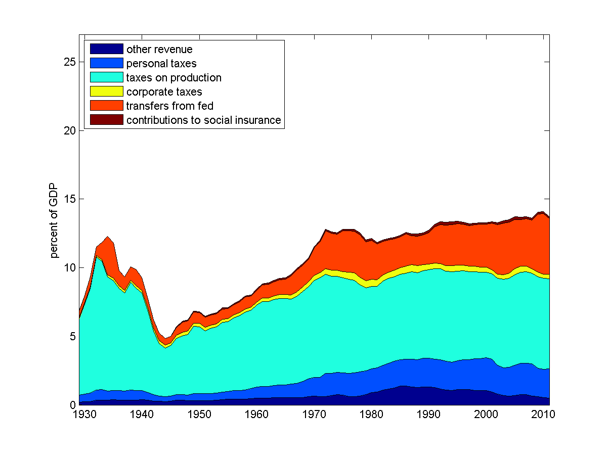
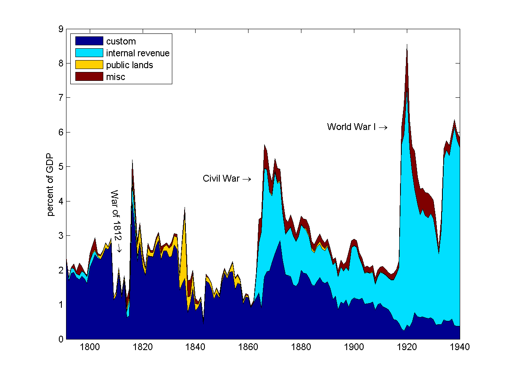
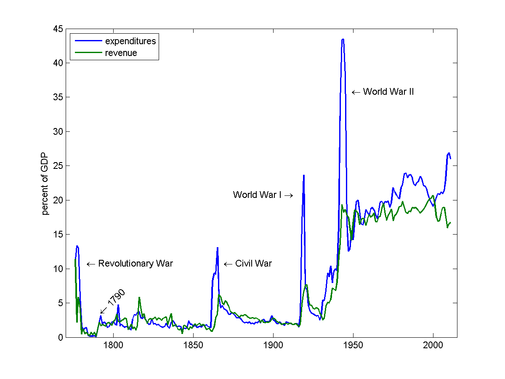
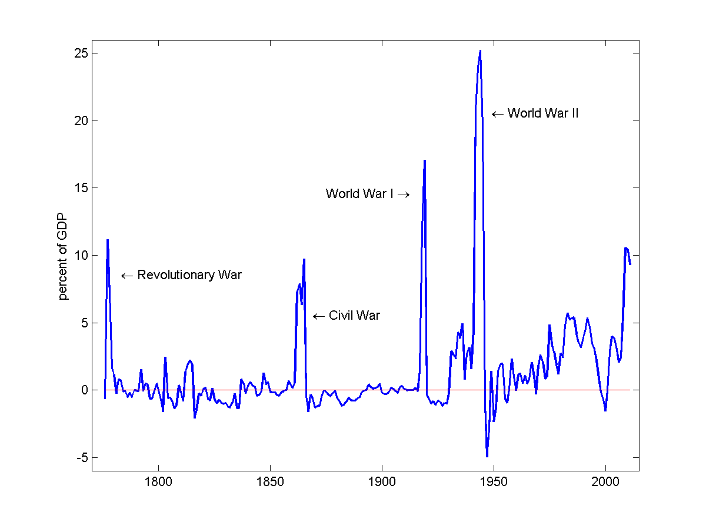

.. _government_budget_constraint:

*********************************
The Government Budget Constraint
*********************************

As we mentioned in the previous lecture, government deficits (i.e. the difference between spending and tax revenues) imply an increase in the nation's public debt.

Debts and deficits are linked through an equation called the government budget constraint.

You may be familiar with this is a relationship between the flow of deficit spending and the stock of debt from your credit card account.

Your Credit Card Bill
======================

If you have a credit card, you get a bill each month.  It probably looks something like this.

.. image:: _static/images/creditbill.jpg
    :scale: 80%
    :align: center

Under the heading "Here is your Account Summary," the holder's new balance is determined by the equation:

.. math::
        \mbox{New Balance}  &=&  \mbox{Previous Balance} \\
        & + & \mbox{ Finance Charge} \\
        & + & \mbox{ New Purchases} \\
        & - & \mbox{ Payments}

Let's re-write this equation as

.. math::
        B_t  =  B_{t-1} + r B_{t-1} + G_t - T_t

where we let 

* :math:`B` denote the balance, 

* :math:`r` denote the monthly interest rate (so :math:`rB` is the finance charge), 

* :math:`G` be new purchases, and 

* :math:`T` be payments.

Before we proceed any further, let's recall the distinction between *stock* and *flow* variables.

Stock Variables and Flow Variables
----------------------------------

*Stock variables* are measured at a point in time.  In example of a stock variable is the location of your car on a highway.  At 1 o'clock on Tuesday you were at mile marker 43.

*Flow variables* are measured over a period of time.  An example of a flow variable is the speed of your car -- measured in miles per hour.  Between 1 o'clock and 2 o'clock, you traveled 60 miles.

So for your credit card

* :math:`B` is a stock variable.  It is the quantity of debt you owe *at a particular point in time*.  

* :math:`r B`,  :math:`G`, and :math:`T` are flow variables.  They represent how much you spent and paid *over a period of time*.

We call equations that link flow variables to their corresponding stock variables, stock-flow equations.  

The Government Budget Constraint
================================

Just as your credit card balance evolves from month to month, a sovereign government's debt 
evolves period to period according to a stock-flow equation we call
the government budget constraint.

At each date :math:`t`:, the following equation must hold.
 
.. math::
        B_{t} =  B_{t-1} + r B_{t-1} + G_t + TR_t - T_t

where

.. math::
   G_t  &=& \mbox{government purchases during period } t \\
   TR_t &=& \mbox{transfer payments (e.g. social security) during period } t \\
   T_t &=& \mbox{taxes collected during period } t \\
   B_{t}  &=& \mbox{this period's } t \mbox{ government debt} \\
   r  &=& \mbox{real interest rate}

You may have seen this equation in one form or another when you took macroeconomics.
Many undergraduate macroeconomics textbooks write it this way

.. math::
     B_{t} =  B_{t-1} + INT_t + G_t + TR_t - T_t

where :math:`INT_t` denotes *net interest payments*.

Defining Government Outlays
----------------------------

*Government purchases* are government expenditures on newly produced goods and services.  
These goods and services are valued at their cost to the government.  Examples of government purchases 
include the provision of public education and national defense and the building of roads.

*Transfer payments* on the other hand is spending in which the government redistributes income.  
These are payments for which government does not receive a good or a service in return.  
It simply writes check to a particular group.
Examples of transfer payments include Medicare, Social Security, and unemployment insurance.  

*Net interest payments* are the interest paid to government creditors less the interest paid to the government by
its debtors (e.g. government loans to small businesses or farmers).  As we will see below, there is more than one
way to measure the costs the government pays to borrow.

Fiscal Accounts
===============

Up to this point we have just referred to "the government."  Of course in the United States, 
at any point in time most people fall under the jurisdiction of three governments simultaneously: 
the federal government, the state government and the local government.

The composition of spending and revenue differ considerably across these three levels.  
At times, it will be useful to lump all three together; but at other times, it be will be 
important to consider the each level separately.

Making comparisons across levels of government can be tricky. Spending and revenue choices 
are the outcome of the budget process which differ across governments. Different governments can operate 
on different fiscal years and employ different budget practices.  For example, some government 
count the sale of bonds and or public assets as "revenue" while other do not [#]_.

Fortunately the Bureau of Economic Analysis (BEA) creates a set of accounts that is consistent 
across all three levels of government.  

We first focus on describing the fiscal accounts of the federal government. 
The federal government reports its receipts, expenditures, and
interest payments in two places: the annual budget issued by the Treasury 
and the Office of Managment and Budget (OMB) and National Income and Product Accounts (NIPA)
computed by the Bureau of Economic Analysis .

OMB
---

Federal government spending and revenue are determined by its annual budgets 
passed by Congress and signed by the President.  Since 1934, these budget numbers 
are reported by the `Office of Management and Budget (OMB)`_.

.. _Office of Management and Budget (OMB): http://www.whitehouse.gov/omb/budget  

Budget spending and revenue number are reported by the fiscal year.  

The federal government operates on a fiscal year which begins on October 1 and ends on 
September 30 of the next calendar year. 
Prior to 1976, the federal fiscal year began on July 1 and ended on June 30.  

The federal budget divides government spending into five categories known as *superfunctions*.  These
categories include all spending for a given topic, regardless of the federal agency that oversees the 
individual federal program. 

The five superfunctions are:
      
          1. national defense
          2. human resources
          3. physical resources 
          4. net interest
          5. other

Spending within these superfunctions are broken down further into twenty functions.

Revenues

U.S. Treasury
-------------

Between 1790 and 1940, the U.S. Treasury reported the budget numbers.  These numbers are available
from the `Annual Report of the Secretary of the Treasury on the State of the Finances`_.

.. _Annual Report of the Secretary of the Treasury on the State of the Finances: http://fraser.stlouisfed.org/publication/?pid=194

Prior to 1940 there were five primary (or top level) categories 
      
          1. war 
          2. navy 
          3. pensions
          4. Indians 
          5. interest

Government spending is also recorded by the Bureau of Economic Analysis in 
a second set of accounts: `the National Income and Product Accounts (NIPA)`_

.. _the National Income and Product Accounts (NIPA): http://www.bea.gov/iTable/index_nipa.cfm

These accounts begin in 1929.

Unlike the budget number reported by the OMB, the numbers reported by the NIPA are quarter and based on the 
calendar year. The NIPA also provides a consistent accounting with state and local government accounts as 
well as GDP
  
Government expenditures within the NIPA are decomposed into four primary or top level categories

     1. Government consumption, :math:`G_t`

     2. Transfer payments, :math:`TR_t`

     3. Net interest payments, :math:`INT_t`
     
     4. Other
     
Other includes ..., and is small.      

The Revolutionary and Continental Accounts
-------------------------------------------

Prior to the establishment of the Department of Treasury in 1790, we will construct our own accounts 
from various reports and ledgers.

With these accounts in mind, let's take a stroll through the data.

Comparison Between Federal and State \& Local
---------------------------------------------

If we combine U.S. federal, state, and local government together, total spending 
is well over 1/3 of GDP.

.. figure:: _static/figures/all_gov_rec_exp.png
    :scale: 60%
    :align: center

    **NIPA: Total Government Receipts and Expenditures as a Percent of GDP**

In the following graph shows the expenditures trends in the primary categories
    

    
    **NIPA: Total Government Expenditures Decomposed By Type**

Current composition of the federal government budget is quite different from state and local budgets.

Federal spending is more heavily weighted toward transfer payments. 

     *The federal government is a gigantic insurance company 
     with a side business in defense.*

State and local governments more directly involved in government purchases

    **NIPA: Federal Expenditures Decomposed By Type**

During World War II, government consumption spending spikes

Since World War II transfer payments have steadily grown as larger share 

    **NIPA: State and Local Expenditures Decomposed By Type**

    **1790-1940: Federal Government Expenditures Decomposed By Type**

.. figure:: _static/figures/federal_expend_decomp_1940_2011.png
    :scale: 60%
    :align: center

    **OMB: Federal Government Expenditures Decomposed By Type**

    
    **OMB: Medicare and Social Security Spending**

Revenue Side
------------

On the 
NIPA: Six principal categories

#. Personal taxes:

  * Personal income taxes

2. Taxes on production and imports

  * sales taxes

  * property taxes
   
  * customs
 
3. Taxes on corporate income

4. Contributions for Social Insurance

  * Social Security

5. Transfers

6. Other

  * income on assets and government enterprises

     
    **NIPA: Federal Revenues Decomposed By Type**

    **NIPA: State and Local Revenues Decomposed By Type**

Revenue: Federal vs. State/Local
--------------------------------

The federal government receives a much large share of its revenues from income taxes
and contributions for social insurance (e.g. Social Security and Medicare).

Revenue to fund state and local governments tend to derive large from 
property and sales taxes and transfers from the federal government.

When we look over the entire history of the U.S., prior to the Civil War, the 
federal government primary source of revenue was customs duties.  After the Civil War, 
internal revenues (e.g. the income tax) become the primary source of revenue.

    
    **1790-1940: Federal Revenues Decomposed by Type**

Deficits and Surpluses
----------------------

The budget deficit that gets reported in the newspaper is

.. math::
  G_t + TR_t + INT_t - T_t

When this number is positive there is a budget deficit.

When this number is negative there is a budget surplus.

The change in the debt is equal to the deficit

.. math::
  B_{t} - B_{t-1}  =  INT_t + G_t + TR_t - T_t

The *net-of-interest deficit* or *primary deficit* is 

.. math::
  G_t + TR_t - T_t

The total or gross deficit tells the amount the government must borrow to
cover all of its expenditures.

The primary deficit ignores interest payments.

Recall the two graphs we saw in the previous lecture.

    **Federal Government Receipts and Expenditures as a Percentage of GDP**

    **Federal Government Deficit as a Percentage of GDP**

A Digression on the U.S. Debt
-----------------------------

Each month, the Bureau of the Public Debt within the U.S. Treasury 
publishes the `U.S. Treasury Monthly Statement of the Public Debt
<http://www.savingsbonds.gov/govt/reports/pd/mspd/mspd.htm>`_.

In this statement, the total outstanding
debt is partitioned two different ways: 

    1. marketable and non-marketable; and

    2. held by the public and held within the government.  
    
After being issued by the Treasury, ownership of marketable securities
can be transferred through purchases and sales in the secondary
market.  Marketable securities are largely made up of Treasury bills,
notes, bonds, and Treasury Inflation-Protected Securities (TIPS).  

In contrast, non-marketable securities are registered to the owner and
cannot be sold in the secondary market, though typically they can be
redeemed on demand. 

Yields on nonmarketable securities are set
administratively, usually by a formula based on the returns for
marketable debt.  

The nonmarketable debt held by the public is largely
held by small investors in the form of savings bonds (U.S. Savings
Securities) or by state and local governments who by law must hold the
proceeds from their own debt issues in Treasury debt until they use
the funds.  

The largest share of the nonmarketable debt,
is held  in the "Government Account Series", a collection of bonds
mostly held by the Social Security trust fund.

While  marketable securities today represent the lion's share of the
debt held by the public, this has not always been the case. 

In the figure below, we plot the debt-GDP ratio for three
different measures of the debt: 

     1.  the marketable debt held by the public; 
     
     2. the sum of the marketable and the nonmarketable debt held
     by the public; and 
     
     3. the total outstanding debt.  
     
Over the entire period, marketable debt has averaged about 80 percent of the total
debt held by the public (i.e the ratio of the solid-blue line to the
dashed-red line).  

Early in the sample, this ratio was about
two-thirds, and it has steadily increased over time. 

Nonmarketable
savings bonds and Victory loans played a much larger role in Treasury
borrowing during World War II and the Korean War than they do today.

Our focus on the government budget constraint compels us to concentrate
on the debt held by the public.  

The Printing Press
-------------------

Since the signing of the U.S. Constitution, 
the federal government can raise revenue by issuing money.  As we will see in a few lectures,
this power has been hotly contested.

The U.S. Constitution explicitly states that state and local governments can not issue their own money.

Therefore the federal government's budget constraint becomes

.. math::
  B_{t}  =  B_{t-1} + r B_{t-1} + G_t + TR_t - T_t  - \frac{M_t - M_{t-1}}{P_t}

where

.. math::
    M_{t}-M_{t-1} &=& \mbox{New money printed this period.} \\
    P_t           &=& \mbox{Price level this period ($t$)} \\
    & & \mbox{i.e. the relative price of money in terms of goods}

This additional term is called *seignorage* or the inflation tax.

Let's re-write the budget constraint as

.. math::
    B_{t}  -  B_{t-1} + \frac{M_t - M_{t-1}}{P_t}  =  r B_{t-1} + G_t + TR_t - T_t

It is common parlance to state that:

      Decisions about :math:`G_t`, :math:`TR_t` and :math:`T_t` are called *fiscal policy*

      Decision about :math:`B_t` and :math:`M_t` are called *monetary policy*.
      
It is clear from the government budget constraint that these two policies are inherently intertwined.      

Before discussing seignorage future, we need to cover a few basics about money.

The Quantity Theory of Money
----------------------------

The *quantity theory of money* describes a simple 
relationship between the money supply, the price level, and output.

It is based on the simple idea that money is just a means of carrying out transactions and
has no effect of the productive capacity of a country.

Think of nominal GDP as the volume of transactions executed in a country, 

If we define velocity, :math:`V`, as the number of transactions each dollar can execute, then

.. math::
   Money \times Velocity &=& Price Level \times Real Output \\
   M     \times  V       &=& P           \times   Y    

where we define

.. math::
   V \equiv \frac{\mbox{Nominal GDP}}{\mbox{nominal money stock}} = \frac{PY}{M}. 

Thus for any values of :math:`M`, :math:`P`, and :math:`Y`, we can compute a value of :math:`V` such that the 
quantity theory holds. The give this theory any bite, we assume that velocity is roughly constant.

If we make this assumption of constant velocity, then this theory implies that
real money demand is proportional to real income.  So
:math:`\frac{M^d}{P} = kY` .

It is often useful to express the quantity theory in terms of growth rates.  If we take natural logs of both sides of the 
equation, we get

.. math::
   \ln M_t   +  \ln V_t       =  \ln P_t +   \ln Y_t.
       
If we step back one period, we get 

.. math::
   \ln M_{t-1}   +  \ln V_{t-1}       =  \ln P_{t-1} +   \ln Y_{t-1}.
   
Subtracting this second equation from the first yields,

.. math::
   (\ln M_{t}-\ln M_{t-1})   +  (\ln V_t - \ln V_{t-1})       =  (\ln P_t - \ln P_{t-1}) +   (\ln Y_t - \ln Y_{t-1})
   
or
   
.. math::
    \frac{\Delta M}{M} + \frac{\Delta V}{V} = \frac{\Delta P}{P} + \frac{\Delta Y}{Y}.   

Again if we assume velocity is constant over time, then

.. math::
    \frac{\Delta M}{M}  = \frac{\Delta P}{P} + \frac{\Delta Y}{Y}.   

For more on the quantity theory of money, see chapter 12 of `The Global Economy`_.

.. _The Global Economy: http://pages.stern.nyu.edu/~dbackus/2303/Global_Economy_web.pdf

Money and Inflation
====================

Inflation is the growth rate of the price level, which typically we measure by a price index such 
as the consumer price index (CPI) or the GDP deflator.  

If we denote inflation by :math:`\pi`, we can write :math:`\pi = \frac{\Delta P}{P}`

There is a famous quote from `Milton Friedman`_, the winner of the 1976 Nobel Prize in economics:

  *Inflation is always and everywhere a monetary phenomenon.*

.. _Milton Friedman: http://en.wikipedia.org/wiki/Milton_Friedman

This claim follows from the quantity theory. In a world without frictions, 
output is determined by a country's capital, labor and land.  Thus changes in the money 
supply have not effect on the growth rate of the output.

If we assume velocity is fixed, the quantity theory of money implies that
changes in the money supply translate one-for-one into changes in the price level.  So
:math:`\pi = \frac{P_{t+1} - P_{t}}{P_t} = \frac{\Delta P}{P} =
\frac{\Delta M}{M}`

Money had no effect on anything anybody cared about.  In other
words money is *neutral.*

The classic dichotomy: money only changes the price level.

Deficits and Inflation
-----------------------

* Recall the government budget constraint

.. math::
      B_{t}  =  B_{t-1} + r B_{t-1} + G_t + TR_t - T_t  - \frac{M_t - M_{t-1}}{P_t}

* Set transfers and government borrowing to zero, so we get
  
.. math::
      G_t  - T_{t} = {{M_{t} - M_{t-1}}\over{P_t}}

* So this is an all-currency economy.

* The revenue that a government raises by printing money is called *seignorage*.  This is the inflation tax.

Typically in the United States seignorage is only a trivial share of government revenue.  
But as we will see, during the Revolutionary War, seignorage comprised

* A great quote by John Maynard Keynes in his 1919 book `The Economic Consequences of the Peace`_, page 235

        Lenin is said to have declared that the best way to destroy the
        capitalist system was to debauch its currency.  By a continuing
        process of inflation, governments can confiscate, secretly and
        unobserved, an important wealth of their citizens. By this method 
        they not only confiscate, but they confiscate arbitrarily; and, 
        while the process impoverishes many, it actually enriches some.
        
.. _The Economic Consequences of the Peace: http://books.google.com/books?id=AX1EAAAAIAAJ&dq=John+Maynard+Keynes,+The+Economic+Consequences+of+the+Peace&source=gbs_navlinks_s

Real seignorage and inflation
------------------------------

Consider our all-currency economy with no government debt.

If the velocity of money is fixed and output is fixed, so real money demand is constant. Then 

.. math::
   \pi = \frac{\Delta P}{P} = \frac{\Delta M}{M}

To derive real seignorage revenue, assume the government increase the money supply
by :math:`\mu` percent each period.  Thus

.. math::
    M_{t} = (1+\mu)M_{t-1}
    
and

.. math::
    \frac{M_{t}-M_{t-1}}{M_{t-1}} = \frac{\Delta M}{M}  = \mu.
    
Seignorage revenue is

.. math::
    \frac{M_{t} - M_{t-1}}{P_t}  &=& \frac{\mu M_{t-1}}{P_t} \\
                                 &=& \mu \frac{M_{t-1}}{P_t} \frac{P_{t-1}}{P_{t-1}} \\  
                                 &=& \mu \frac{P_{t-1}}{P_t} \frac{M_{t-1}}{P_{t-1}} \\  
                                 &=& \frac{\mu}{1+\pi} \frac{M_{t-1}}{P_{t-1}} 
                                 
If the inflation rate, :math:`\pi` equals the money growth rate, :math:`\mu` as implied by the quantity
theory of money, then seignorage revenue is

.. math::

    \frac{M_{t} - M_{t-1}}{P_t}  = \frac{\mu}{1+\mu} \frac{M_{t-1}}{P_{t-1}} = \frac{\mu}{1+\mu} \Phi
    
where :math:`\Phi` denotes the demand for real money balances.    

So seignorage is a tax on real money balances.  The tax rate can be expressed either in terms
of the inflation rate or the money growth rate.

.. math::
 
     \frac{\mu}{1+\mu}  = \frac{\pi}{1+\pi}
 
That's why it is called the inflation tax.

The government collect revenue from the inflation tax when it
buys goods with newly printed money.

So Friedman's really should have said,
  *Inflation is always and everywhere a fiscal phenomenon.*

Since seignorage is a distortionary tax, as the government
increases this tax, people will hold lower real balances.

Whether seignorage rises or falls depends on whether inflation
rises more or less than the decline in money holdings.  We will discuss
this in more detail in a couple of lectures.

Government Debt is a Weighted Accumulation of Past Deficits
------------------------------------------------------------

To keep the analysis simple, ignore transfers and money creation for now.

A time :math:`t` the government budget constraint is:

.. math::
    B_{t}  =  (1+r)B_{t-1} + G_t  - T_t

A time :math:`t-1` the G.B.C. is:

.. math::
    B_{t-1}  =  (1+r)B_{t-2} + G_{t-1}  - T_{t-1}

A time :math:`t-2` the G.B.C. is:

.. math::
    B_{t-2} =  (1+r)B_{t-3} + G_{t-2}  - T_{t-2}

Substitute for :math:`B_{t-1}`

.. math::
    B_{t}  &=&  (1+r) \left((1+r)B_{t-2} + G_{t-1}  - T_{t-1} \right)  + G_t  - T_t \\
           &=&  (1+r)^2 B_{t-2} +(1+r)\left( G_{t-1}  - T_{t-1} \right)  + G_t  - T_t

Substitute for :math:`B_{t-2}`

.. math::
   B_{t}  &=&  (1+r)^3 B_{t-3} + (1+r)^2\left( G_{t-2}  - T_{t-2} \right) + (1+r)\left( G_{t-1} - T_{t-1} \right)  + G_t  - T_t

Keep going to the beginning of time (i.e. :math:`t=0`)

.. math::
     B_{t} =  (1+r)^t B_{0} + \sum_{j=0}^{t} (1+r)^j \left( G_{t-j}  - T_{t-j} \right)

The left hand side of this equation is the current stock of debt.  The right hand side of this equation is the weighted sum
of past deficits.

Government Debt is a Weighted Sum of Future Surpluses
------------------------------------------------------

A time :math:`t` the government budget constraint is:

.. math::
    B_{t}  =  (1+r)B_{t-1} + G_t  - T_t

A time :math:`t+1`

.. math::
    B_{t+1}  =  (1+r)B_{t} + G_{t+1}  - T_{t+1}

or

.. math::
    B_{t}  =  \frac{1}{1+r} \left( B_{t+1} + T_{t+1}  - G_{t+1} \right)

Thus we can write :math:`B_{t+1}` as

.. math::
    B_{t+1}  =  \frac{1}{1+r} \left( B_{t+2} + T_{t+2}  - G_{t+2} \right)

Substitute

.. math::
    B_{t}  =  \frac{1}{1+r} \left( \frac{1}{1+r}\left( B_{t+2} + T_{t+2}  - G_{t+2} \right)+ T_{t+1}  - G_{t+1} \right)

Do this 100 times

.. math::
   B_{t}  =  \left(\frac{1}{1+r}\right)^{100} B_{t+100}  + \sum_{j=1}^{100} \left(\frac{1}{1+r}\right)^{j}(T_{t+j} -G_{t+j})

Do this an infinite number of times

.. math::
   B_{t}  =   \sum_{j=1}^{\infty} \left(\frac{1}{1+r}\right)^{j}(T_{t+j} -G_{t+j})

This equation states that the current value of debt is the discounted summation of future primary surpluses.

Debt is both a backward-looking and a forward-looking variable  Thus it connects the past with the future. 
It is the sum of past deficit spending.  It is also the sum of future surpluses.

Exercises
=========

1. **The Power of Compound Interest**

    The following problem may be done on EXCEL.

    Consider a government that initially has no debt.  The Minister of Finance proposes the following twenty-year plan.  
    For each year for the first ten years, the government will collect \$75 billion in tax revenue (:math:`T`) and spend 
    \$77 billion on government services (:math:`G`) (excluding interest payments); thus the country will run an primary 
    deficit of \$2 billion per year for first ten years.

    The government will finance its deficits by continually rolling over one-year loans at an annual interest rate of 6 percent.

    The government has the following budget constraint

    .. math::
          B_{t+1} = B_t + r_t B_t + G_t - T_t

    Starting in year 11, the government will begin to pay back its debt.  For years 11-20, it will continue collect \$75 billion 
    in revenue each year, but will set annual expenditures such that at the end of year 20, the debt is zero.  If the government 
    wants to keep spending from year 11 to year 20 constant (i.e. :math:`G_{11} = G_{12} = G_{13} = ... = G_{20} = \bar{G}`).  
    What is the maximum value of :math:`\bar{G}` that will allow the government to pay back its debt in ten years?

    You can deduce :math:`\bar{G}` by trial and error or you can use `an amortization formula`_.

..  _an amortization formula: http://en.wikipedia.org/wiki/Amortization\_calculator

2. **Credit Card Debt**

    To see why some families get into trouble with their credit cards, consider the following variation on the above problem.

    For ten years, a household has \$75,000 in annual income and spends \$77,000 per year on stuff they need and really want; 
    thus they are "only" spending \$2,000 more then their income each year.  They finance their deficit spending by borrowing 
    off their credit card at an 18\% annual interest rate. They make no payments on their debt.

    The annual law of motion for their credit card balance is

    .. math::
             Balance_{t+1} = Balance_t + r_t \times Balance_t + Spending_t - Income_t

    For each of these ten years, compute their annual interest charge and their end-of-year credit card balance.  In year 10, 
    what is their stock of debt as a percentage of their income?

    At the beginning of year 11, the household commits to paying off their debt over the next ten years.  Their annual income 
    remains at \$75,000, and the interest rate remains at 18\%. They want to keep their non-debt payment spending constant, 
    at say :math:`\bar{S}`, over years 11-20.   What is the highest amount they can spend while extinguishing their debt by year 20?

Footnote
--------

.. [#] For a discussion of different state budgets and their varying accounting rules, see Ratvich, Richard and Paul Volker (2014) 
       "Report of the State Budget Crisis Task Force" available from
       `www.statebudgetcrisis.org`_.

.. _www.statebudgetcrisis.org : http://www.statebudgetcrisis.org/wpcms/
