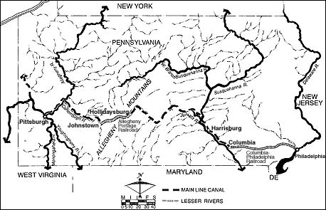

.. _internal_improve:

**************************************
Public Lands and Internal Improvements
**************************************

* Questions and Visions

* Northwest Territory and the Louisiana Purchase

* Gallatin's Report

* Clay's American System

* State Financed Internal Improvements

* Jackson, Lincoln, and Roosevelt

Questions
=========

* How should the government dispose of public lands?

* How much national planning should a government perform?

* What is the government's role in funding public works or infrastructure?

   * internal improvements

   * for example, interstate highway system

* Is the Union a mere confederation of states or is it a national government?

George Washington's Vision
--------------------------

* In 1784 George Washington noted that settlers were streaming into the Ohio Valley.  Their only waterways to the ocean led

     *  to Spanish controlled New Orleans via the Mississippi River, or

     *  through the St. Lawrence and British Canada via the Great Lakes

* Nonexistence transportation system made it difficult, if not impossible, for farmers and others to move their goods to market.

* Roads were rough and unreliable.

* Transportation by rivers was often impossible due to waterfalls and rapids.

* Washington was worried that new nation might break apart because of the physical barriers to effective trade and communication.

Internal improvements as an impetus for a new constitution
----------------------------------------------------------

* Washington's proposal to bind the nation together was a coordinated system of canals and portage roads across the Alleghenies,
  especially ones that would connect the Ohio River to a navigable Potomac River.

* Needed to build canal locks around the Potomac's five major waterfalls

* This required a formal treaty between Maryland and Virginia, approvals from other states and from the Continental Congress.

* To settle this dispute Washington convened a meeting between Maryland and Virginia legislators at Mount Vernon in 1785

     * Their dissatisfaction with the barriers that the Articles placed to 
       interstate commerce and improvements led them to convene the Annapolis 
       Convention in 1786 to which leaders from the 13 states were invited.

* The `Annapolis Convention`_ then issued the call for a Constitutional Convention to meet in Philadelphia in 1787.

.. _Annapolis Convention: http://en.wikipedia.org/wiki/Annapolis_Convention_%281786%29

* James Madison in his `Federalist Paper 14`_ specifically defended the new Constitution as forming a government that 
  would unite the
  country through new roads and canals.
  
.. _Federalist Paper 14: http://www.constitution.org/fed/federa14.htm

Thomas Jefferson's Vision
-------------------------

* In the early 1780s, the Continental Congress won control of the land in the western territories not in the original 13 states.

* Jefferson saw this vast unsettled territory as the ground for a democratic, agrarian society.

* Jefferson proposed selling the land in small units for family farms that would be the economic underpinning of a political democracy.

* Problem: the inability in an unsettled wilderness to provide clear title and boundaries to small plots.

* Solution: a vast land survey to map the whole Western territories on a square-mile continental grid oriented to the cardinal points of the compass.

* Land would be grouped into townships six miles by six miles (the local political unit for the new territories)

   * 36 square-mile sections that made up a township would be sold either as

       * complete sections (640 acres),

       * half (320)

       * quarter-sections (160 acres, thought to be the smallest unit that could support a family).

* Example:  `Seven Ranges in Southeast Ohio`_

.. _Seven Ranges in Southeast Ohio: http://www.ohiohistorycentral.org/w/Seven_Ranges

* Did not solve the problem Washington had foreseen: the lack of a transportation infrastructure to get crops to market.

    **Seven Ranges**

Land Ordinances of 1784 and 1785
--------------------------------

* After the revolution the U.S. had the huge amount of western land

    * need mechanisms for selling and developing the land

    * admitting states

* `Land Ordinance of 1784`_

.. _Land Ordinance of 1784: http://www.ohiohistorycentral.org/w/Ordinance_of_1784

    * Written by Jefferson, with Jefferson ideals

    * western land will be divided up in new states, equal to existing states

    * strong on principles, light on mechanics

* `Land Ordinance of 1785`_

.. _Land Ordinance of 1785: http://www.ohiohistorycentral.org/w/Land_Ordinance_of_1785

    * divide up the land into grids

    * pay for public education, section 16

The Northwest Ordinance
-----------------------

* `Text of the Northwest Ordinance`_

.. _Text of the Northwest Ordinance: http://avalon.law.yale.edu/18th_century/nworder.asp

* More than just a law

    * Political  and legal aspects of westward expansion

    * passed by the Continental Congress in 1787

    * signed by President Washington in 1789 under the new Constitution

* Created the Northwest Territory

* Existing states would not just expand westward.

   * ceded all unsettled land to the federal government

   * admission of new states

1803 Louisiana Purchase
-----------------------

* 828,000 square miles

* First of several large U.S. territorial acquisitions

* What to do with the land?

* Topic for another day

.. figure:: _static/figures/U.S._territorial_acquisitions.png
    :scale: 40%
    :align: center

    **Territorial Acquisitions**

Constitutional Issues
---------------------

Article 1, Section 8 of the Constitution states:

.. epigraph::

    The Congress shall have Power To lay and collect Taxes, Duties, Imposts and Excises, to pay the Debts and provide for the common
    Defence and general Welfare of the United States; but all Duties, Imposts and Excises shall be uniform throughout the United
    States; ...

    To regulate Commerce with foreign Nations, and among the several States, and with the Indian Tribes;

* No where in the Constitution is there any mention of internal improvements.  What does "general Welfare" mean?

* "Implied powers" debate

* Are (Which) internal improvements (are) "inter-state commerce"?

Practical issues
----------------

John Larson [Larson1991]_, page 71 cites five challenges for supporting internal improvements at the state-level

1. natural advantages are not evenly distributed

2.  political geography and nature seldom work in concert

     * rivers flow across state lines

3. local financial resources usually not sufficient to support large risky projects

4. transportation technology advancing rapidly (uncertainty?)

5.  some Americans viewed all development as exploitative, corrupt and unrepublican

Gallatin's 1808 *Report on the Subject of Public Roads and Canals*
========================================================================

The report is available here_.

.. _here: http://oll.libertyfund.org/index.php?option=com_staticxt&staticfile=show.php%3Ftitle=2046&Itemid=28

In 1807 the U.S. Senate resolution for Treasury report proposing ways that the federal
government could address transportation problems.

Two policy goals

    1. Thomas Jefferson's determination that the vast lands controlled by the national government beyond the borders of the original
    thirteen states be sold under conditions carefully designed to create a nation of independent small farmers.

    2. George Washington's determination that the newly-settled lands in the American interior be linked to the markets and Atlantic
    ports of the East Coast.

The Gallatin Plan in effect put Washington and Jefferson together

    * a national system of roads and canals would open up vast land tracts for sale by the federal government;

    * the revenue from these sales would pay for the new infrastructure; and

    * the Plan would ultimately create a new egalitarian society.

The Plan therefore had two main components:

  1. a set of roads and canals to improve transportation along the Atlantic coastline, including a north-south national turnpike
  road (the earliest version of Interstate 95) and canals cutting across Cape Cod, New Jersey from the Raritan to the Delaware, the
  Delmarva peninsula, and the Dismal Swamp to shorten intercoastal shipping routes.

  2. the more difficult, expensive but vitally necessary canal and road systems over the Alleghenies.

       * an all-water route in New York State via the Hudson and Mohawk Rivers to a new canal to connect with Lake Ontario;

       * three water-and-road routes where the eastern river would be made navigable as far west as 
         possible, and a road to carry
         goods the remaining distance over the mountains to a western river.

.. figure:: _static/images/gallatin_map.jpg
    :scale: 60%
    :align: center

    **Gallatin's Map**

Gallatin proposed private-public partnerships with the federal government advancing loans or purchasing stock in the canal companies.

Argued that federal funds would overcome the limitations of the private capital market.

Did not happen

    * The War of 1812 drained away the federal surplus that Gallatin hoped would be available for infrastructure.

    * The great divide between slave and free states made a truly National System (as Henry Clay and John Quincy Adams styled their
      later versions of the Gallatin Plan) impossible.

The End of the War of 1812
--------------------------

* Madison goes to Congress in December 1815 asks for:

    * new national bank

    * protective tariff

    * military investment

    * improved costal defenses

    * construction of roads and canals

* Madison gets the new bank and protective tariff

Henry Clay and *The American System*
------------------------------------

* `Henry Clay`_, Kentucky,

.. _Henry Clay: http://en.wikipedia.org/wiki/Henry_Clay

    * served in both the House and Senate

    * Secretary of State under John Quincy Adams (the "corrupt bargain")

* Surge of imports after the end of War of 1812

* Tariff of 1816

    * instituted primarily for protection, not revenue

* Question: what to do with revenue?  How to maintain political support for high tariffs?

    * Clay developed a policy which became known as the *American System*

* Three parts

   1. Strong banking system to provide easy and abundant credit

   2. Protective tariffs to benefit eastern manufacturing

   3. Use revenue to build a set of roads and canals to benefit the west

* The South is out of luck.

* The American System is named to contrast with *British System* of Adam Smith.

Bonus Bill of 1817
------------------

* Resurrection of the Gallatin Plan

* Senator Calhoun from South Carolina introduced the bill on February 4, 1817

* Pledge \$1.5 million due the Treasury from the new Federal bank.

    * plus share of future dividend revenue

* No specific projects named

    * just set aside the money for specific later appropriations of internal improvements.

    * Calhoun proposed as an open-ended financing mechanism for improvements.

    * Due to compromises, each state benefit in proportion to population and approve all federal activities within its borders.

* Vetoed on March 3, 1817, by James Madison on his last day as president.

    * argued unconstitutional

    * huge surprise

    * Madison was Secretary of State for the Louisiana Purchase

* This veto marks an end of efforts to establish a federal system of internal improvements

    * moves things back to states

New York: Erie Canal
====================

* The `Transcontinental Railroad`_  and the `Erie Canal`_ are the most famous internal improvements.

.. _Transcontinental Railroad: http://en.wikipedia.org/wiki/First_Transcontinental_Railroad

.. _Erie Canal: http://www.eriecanal.org/

* `New York Governor DeWitt Clinton`_ saw the possibility of a canal far more ambitious than those proposed by Gallatin.

.. _New York Governor DeWitt Clinton: http://en.wikipedia.org/wiki/DeWitt_Clinton

* In December 1811, Clinton and Gouvenor Morris went to Washington to ask for Federal money

* A 363 mile artificial waterway across New York from the Hudson River (around Albany) to Lake Erie (around Buffalo)

* Without it, Great Lakes traffic would go north toward Montreal and St. Lawrence. Mississippi Valley traffic would go south through St. Louis and New Orleans.

* First proposed in 1808, under construction from 1817 to 1825, opened on October 26, 1825.

* Financed by New York State

   * originally opposed by New York City politicians

* The Erie Canal pivoted the nation's commerce from North-South to East-West

   * led to the importance of New York City and Chicago

   * made New Orleans less important.

* Moved the financial center of the U.S. from Philadelphia to New York City.

.. figure:: _static/images/erie_canal_map.jpg
    :scale: 70%
    :align: center

    **Erie Canal**

Pennsylvania: A Desperate Imitation
-----------------------------------

* Saw the success of the Erie Canal to the North

* Appointed a Board of Canal Commissioners in 1825

* Began to construct a series of canals between Philadelphia and Pittsburgh

     * greater engineering challenge than Erie

* Politics led to trading branch lines for votes: "canals to nowhere"

* Did not earn revenue until 1834, never enough to cover interest payments

* After 1846 competed with the private Pennsylvania Railroad

    **Pennsylvania Canal System**

Other State Initiatives
-----------------------

* Ohio built canals to link the Ohio River to Lake Erie

* Maryland, with help from Virginia, Pennsylvania and the federal government began the Chesapeake and Ohio Canal.

John Quincy Adams
-----------------

* Expanded the idea of internal improvements beyond transportation.

     * Proposed a national university in Washington D.C. and a publicly funded national astronomical observatory.

     * Envisioned an educational, moral, and spiritual improvement of the nation that would contribute to economic development.

* Instead of an grand national plan

    * pork-barrel projects

    * small disconnected projects

Andrew Jackson
--------------

* Clay's American System ran into strong opposition from President Jackson's administration.

* One of the most important points of contention between the two men was over the Maysville Road.

* Jackson vetoed a bill which would authorize federal funding for a project to construct a road linking Lexington and the Ohio River, the entirety of which would be in the state of Kentucky, because he felt that it did not constitute interstate commerce, as specified in the Commerce Clause of the United States Constitution.

* Jackson never said he opposed to national projects.

* Expenditures actually surged under Jackson.

.. figure:: _static/figures/federal_improve_per_gdp.png
    :scale: 60%
    :align: center

    **Federal Expenditures for Internal Improvements as a Percent of GDP**

Fast Forward to the 1860s
-------------------------

* The federal government regained its direct power over national planning in the 1860s, when the secession of the Southern states in the Civil War broke the deadlock that had paralyzed the national government.

* Return to the American System

* Morrill Tariff of 1861

* With the strong support of Abraham Lincoln, Congress in 1862 passed the Homestead Act that awarded 160 free acres of federal land to any family that would claim and farm it.

    * The Homestead Act was Jefferson's 1784 Land Ordinance on steroids.

* In 1862 Congress passed the Pacific Railway Act, authorizing the first transcontinental railroad (completed in 1869).

Fast Forward to the 1930s: The New Deal
---------------------------------------

* Smoot-Hawly Tariff of 1930

* New Deal programs

    * Public Works Administration

    * Tennessee Valley Authority

    * Rural Electrification Administration

