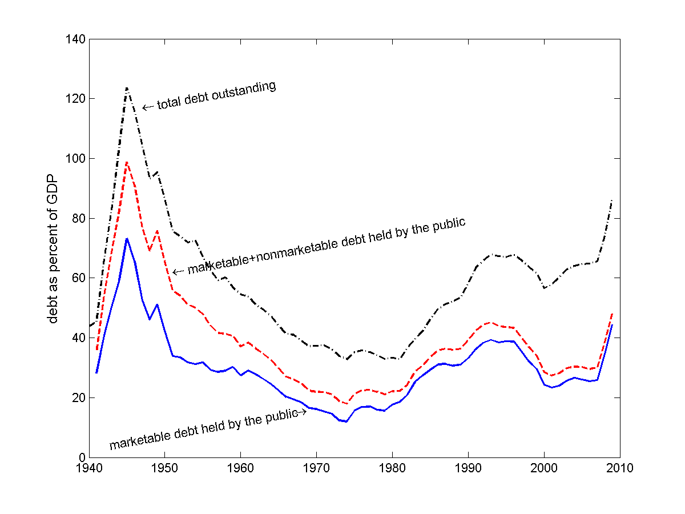

.. _post_world_war_II:

*****************
Post World War II
*****************

Evolution of the Post World War II Debt/GDP Ratio

    **Marketable Debt held by the Public, Total Debt held by the Public, and Total Debt Outstanding**

.. figure:: _static/figures/strippedIOUS_mesh.png
    :scale: 60%
    :align: center

    **Payments Owed by Year and Maturity Divided by GDP**

.. figure:: _static/figures/cof_returns_gdpdef.png
    :scale: 60%
    :align: center

blah, blah

    **Comparison of the Official Interest Costs and Holding Period Returns**

   +--------------------------------------+----------+---------+
   | Variable                             |  Mean    | Std Dev |
   +======================================+==========+=========+
   | Official Interest/Debt               |   5.20   |    2.54 |
   +--------------------------------------+----------+---------+
   | Inflation                            |   3.73   |    2.67 |
   +--------------------------------------+----------+---------+
   | Official Interest/Debt - inflation   |   1.47   |    3.31 |
   +--------------------------------------+----------+---------+
   | Real Return on Marketable Debt       |   1.63   |    4.86 |
   +--------------------------------------+----------+---------+

   **Means and Standard Deviations of Returns**

     +-------+--------++------+-------+--------++--------+-----------+---------+-----------+
     |                ||     Debt to GDP       ||  Bond  |           | GDP     |   Deficit |
     +                ++------+-------+--------++        +           +         +           +
     |    Period      || start|  end  | change || return | Inflation |  Growth |   to GDP  |
     +=======+========++======+=======+========++========+===========+=========+===========+
     | 1941  | 1945   || 37.0 | 97.2  | 60.2   ||  2.8   |  -9.7     |  -20.5  |  84.7     |
     +-------+--------++------+-------+--------++--------+-----------+---------+-----------+
     | 1945  | 1974   || 97.2 | 16.9  | -80.3  ||  32.8  | -50.2     |  -31.8  | -34.7     | 
     +-------+--------++------+-------+--------++--------+-----------+---------+-----------+
     | 1974  | 1981   || 16.9 | 19.9  | 3.0    ||  12.4  | -11.0     |   -4.4  |   5.8     | 
     +-------+--------++------+-------+--------++--------+-----------+---------+-----------+
     | 1981  | 1993   || 19.9 | 48.2  | 28.3   ||  37.6  | -13.5     |  -12.6  |  17.8     |
     +-------+--------++------+-------+--------++--------+-----------+---------+-----------+
     | 1993  | 2001   || 48.2 | 28.5  | -19.7  ||  14.6  |  -5.9     |  -12.2  |  -15.9    |
     +-------+--------++------+-------+--------++--------+-----------+---------+-----------+
     | 2001  | 2009   || 28.5 | 48.8  | 20.3   ||   9.3  |  -5.8     |   -3.9  |  20.8     |
     +-------+--------++------+-------+--------++--------+-----------+---------+-----------+
     | 1941  | 2009   || 37.0 | 48.8  | 11.8   ||  109.4 |  -96.3    |  -85.3  |  78.5     |
     +-------+--------++------+-------+--------++--------+-----------+---------+-----------+
     | 1945  | 2009   || 97.2 | 48.8  | -48.4  ||  106.6 |  -86.5    |  -64.8  |   -6.2    | 
     +-------+--------++------+-------+--------++--------+-----------+---------+-----------+
 
     **Contributions to Changes in the Debt-to-GDP Ratio**

* The U.S. paid off its WWII debt with a mixture of low returns (inflation), GDP growth, and primary surpluses.

* The U.S. did not really inflate away its debt in the 1970s. 

* Debt-holders received large positive real returns in the early 1980s as inflation came down. 

* Since the 1990s the real return on debt has about equaled GDP growth so the change in :math:`B/Y` has about equaled the primary surpluses.

