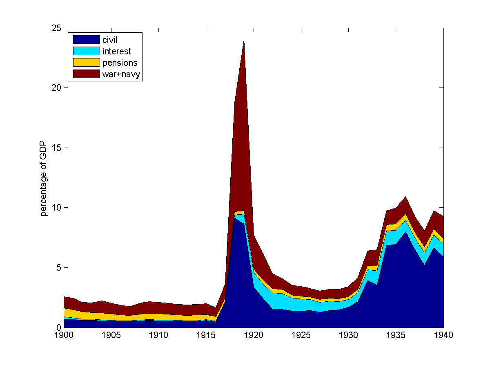
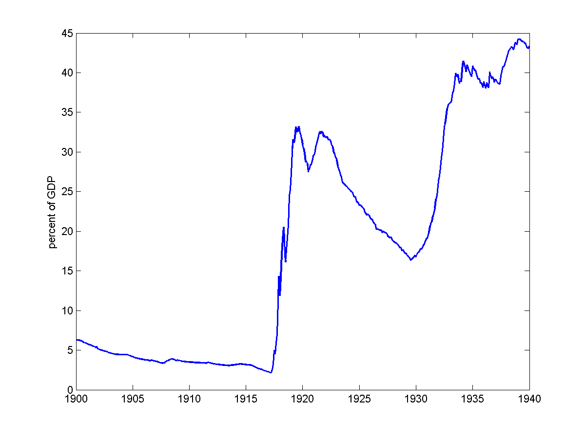

.. _world_war_I:

***********
World War I
***********

1. Key Events Prior to the War
   * Panic of 1907
   * establishment of the Federal Reserve

* 1914 Crisis

* Funding the War Effort

   * taxes
   
   * borrowing: the Liberty Loans

* Refinancing of the War Debt

    * moving from "project finance" to a permanent, liquid debt

    * evolution of the debt ceiling

Key Events Prior to War

    * 1907 Panic

    * 1913 Income Tax

    * 1913-1914 Establishment of the Federal Reserve System

    * 1914 New York Stock Exchange shut down for nearly five months

The Panic of 1907

* 1907

     * No central bank

     * No deposit insurance, but clearing houses

* Recall how a bank works

     * takes deposits

     * make loans, keeps less that 25\% of deposits on reserve

* Fall 1907: Concerns about losses in copper speculation

* On October 22 a bank run on the Knickerbock Trust Company

     * second largest trust company in New York

     * Trust is a bank that does not issue currency, faced fewer regulations

           * part of the `shadow banking`_ system, outside clearing house system

.. _shadow banking: https://www.imf.org/external/pubs/ft/fandd/2013/06/basics.htm

     * in two hours, paid out \$8 million

     * closed their doors

* Contagion spread to other trusts and banks

     * many bank closed their doors/suspended convertibility

* regional stock markets closed

* In response, J.P Morgan, the U.S. Treasury, John D. Rockefeller

     * reviewed bank books, decided which were solvent, made loans

     * even they did not have enough resources to hold back the tide

     * convinced banks to pool resources, help each other out

* Sharp contraction of the money supply led to a severe recession

Stopping a Banking Panic

     * Provide loans to solvent banks, shut down insolvent banks.

     * Print more cash

Outcome of 1907

     * Aldrich-Vreeland Emergency Currency

     * Establishment of the Federal Reserve System

Key World War I Dates

     * July 28, 1914 War begins

     * April 4, 1917 U.S. declares war on Germany

     * November 11, 1918 Armistice Day

1914 : McAdoo Shuts Down the the NYSE
=====================================

* July 28, 1914 war begins

* U.S. is on the gold standard

* U.S. is a net debtor

    * foreign holdings of U.S. assets: \$6 billion

    * U.S. holdings of foreign assets: \$1 billion

* Belligerents want to convert U.S. holdings to gold and repatriate them back to Europe.

* Government and finance industry worried about bank runs

* William Silber *When Washington Shut Down Wall Street: the Great Financial Crisis of 1914
  an the Origins of America's Monetary Supremacy*

1914: McAdoo Shuts Down the the NYSE
------------------------------------

* To stop gold outflows, McAdoo "encouraged" the NYSE to shut down from July 31, 1914 to November 28, 1914.

* Disbursed Aldrich-Vreeland emergency currency

* Encouraged and arranged for the export of agricultural goods

* Kept the U.S. on the gold standard through the war

     * Britain imposed controls on gold during the war

    **Treasury Secretary William G. McAdoo**

How to Pay for the War? Taxes or Debt?
======================================

* McAdoo studies Chase's financing of the Civil War

     * learns what not to do

     * no mention of Gallatin

* Can not borrow from abroad.

* Disparate Opinions

     * Chair of Senate Finance Committee: debt finance

     * J.P. Morgan: taxes, not exceed 20\%

     * "leading economists": primarily taxes

     * McAddo: 1/2 - 1/2; later 1/3 taxes, 2/3 debt

Theory at the Time
------------------

* High taxes would control inflation

* Taxation was fairer

    * placed the burden on those who could best afford it

    * with loans, a soldier drafted in the army would suffer doubly

       1. while serving in the army
       
       2. higher taxes when he returned

.. figure:: _static/figures/receipts_expenditures_1900_1940.png
    :scale: 60%
    :align: center

    **Federal Revenues and Expenditures**

    **Composition of Federal Expenditures by Type**

    **Composition of Federal Revenues by Source**

Taxes
-----

* Individual Income Tax

    * Constitutional amendment required

    * introduced in 1913, part of the Underwood-Simmons Tariff

* Corporate Income Tax

    * introduced in 1909

* Excess Profit and War Profit Tax

    * introduced during the war

    * government estimated "reasonable" profits for each company.

    * terrible incentives, but promised short duration

* Rockoff, page 118, states these taxes accounted for 40\% of tax revenue

.. figure:: _static/figures/1914.png
    :scale: 60%
    :align: center

    **1914 Marginal Income Tax Rates**

.. figure:: _static/figures/1918.png
    :scale: 60%
    :align: center

    **1918 Marginal Income Tax Rates**

To watch the `evolution of the marginal tax rates`_ from 1913 to 192X as movie.

 .. _evolution of the marginal tax rates:file:///C:/Users/ghall/Documents/FiscalHistory/webpage/_static/figures/tax_rate_movie.avi

    
**Maximum and Minimum Marginal Income Tax Rates**
.. \centerline{\psfig{file=min_max_marginal_income_taxes.ps,width=3.5in}}

.. figure:: _static/figures/primary_deficit_to_gdp_1900_1940.png
    :scale: 60%
    :align: center

    **Gallatin Tax Smoothing and then ...**

.. figure:: _static/figures/barro_tax_smooth.png
    :scale: 60%
    :align: center

    **Deficits Under Tax Smoothing**
    

Borrowing: The Liberty Loans
----------------------------

* April 28, 1917 First Liberty Loan approved

* just 20 days after war declared

* By 1917, no expectation that the war would be short and cheap

* immediate move to long-term borrowing

    +----------------------+--------------+---------------------------------------+------------------+-----------------+
    |                      |    Maturity  | Coupon Rate                           |      Issue Date  |      Amount     |
    +----------------------+--------------+---------------------------------------+------------------+-----------------+
    | First Liberty Loan   |   30-yr      |   :math:`3\frac{1}{2}`                |  June 1917       |   \$2.0 billion |
    +----------------------+--------------+---------------------------------------+------------------+-----------------+
    | Second Liberty Loan  |   25-yr      |   :math:`4`                           |  Nov 1917        |   3.8 billion   |
    +----------------------+--------------+---------------------------------------+------------------+-----------------+
    | Third Liberty Loan   |   10-yr      |   :math:`4\frac{1}{4}`                |  May 1918        |   4.2 billion   |
    +----------------------+--------------+---------------------------------------+------------------+-----------------+
    | Fourth Liberty Loan  |   20-yr      |   :math:`4\frac{1}{4}`                |  Oct 1918        |   7.0 billion   |
    +----------------------+--------------+---------------------------------------+------------------+-----------------+
    | Victory Liberty Loan |   4-yr       |   :math:`3\frac{3}{4}` if non-taxable | May 1919         |   4.5 billion   |
    |                      |              |   :math:`4\frac{3}{4}` if taxable     |                  |                 |
    +----------------------+--------------+---------------------------------------+------------------+-----------------+
    |                      |              |                                       |                  |  \$21.4 billion |
    +----------------------+--------------+---------------------------------------+------------------+-----------------+

              **The Liberty Loans**

From Garbade, page 65

    **Debt-to-GDP Ratio**

Designing the Liberty Loans
---------------------------

* McAdoo wanted to minimize cost to the taxpayer

* He also wanted no failed offering

* did not want to rely on short-term borrowing or fiat money

Prior to the war, interest on Treasury bonds had been tax exempt

   * problem: tax exemption only valuable to high-income buyers

   * low coupon rates made the bonds less attractive to middle-income buyers

   * wanted middle class to invest in bonds, so that after the war the country would not be taxing the poor to repay the rich.

   * aligning future politics for repayment

* Concern that as the war would do on, interest rates would rise

Liberty Loans
-------------

Contractual provisions

1. To mitigate the risk that an investor's securities would depreciate
   if rising interest rates later forced the Treasury to sell higher 
   coupon debt, the Treasury sold bonds that could converted into new 
   bonds earning the higher rate.  (Ghost of the War of 1812)

2. To attract high-income investors during a period of temporary high 
   tax rates, the Treasury sold bonds with tax exemptions limited to the duration of the war.

3. Also sold interconvertible notes with various coupon rates and tax provision.

From Garbade, page 144

The Selling of the Liberty Loans
--------------------------------

* Loans too big to sell just to banks

* No ability to sell to foreigners

* McAdoo did not want pay for a "Jay Cooke" middleman.  He stated

.. epigraph:: 

    We went directly to the people: and that means to everybody -- to businessmen, workmen,
    farmers, bankers, millionaires, schoolteachers, laborers.  We capitalized the profound
    impulse called patriotism.

Cite  Crowded Years 
Fund drives, McAdoo, celebrities

Like Jay Cooke, sold bonds in small denominations on installments

    **Liberty Bonds**

.. figure:: _static/images/liberty-bonds.jpg
    :scale: 60%
    :align: center

    **Liberty Bonds**

Post-War Tax Reductions
-----------------------

Both Presidents Warren Harding and Calvin Coolidge advocated for lower taxes

   * eliminate the excess-profit tax

   * reduce surcharges on individual incomes

Treasury Secretary Andrew Mellon made a "supply-side" case for lower taxes.
Argued that high upper bracket tax rates

   1. stifled initiative

   2. diverted investment to tax-exempt state and local bonds

   3. reduced federal tax revenue

Thus **lower** rates would lead to **more** tax revenue.

    **Treasury Secretary Andrew Mellon**

    **1920 Marginal Income Tax Rates**

.. figure:: _static/figures/1924.png
    :scale: 60%
    :align: center

    **1924 Marginal Income Tax Rates**

    +-------+-----------------+-----------------+---------+--------+
    |       |       Revenue                     | percent | Per    |
    +       +-----------------+-----------------+         +        +
    |       |  nominal        |  1929 dollars   | of GDP  | Capita | 
    +=======+=================+=================+=========+========+
    |  1914 |	\$71,381,275  |   \$126,187,950	| 0.20\%  | \$1.27 |
    +-------+-----------------+-----------------+---------+--------+
    |  1915 |	80,201,759    |  141,052,991    | 0.21    | 1.40   |	
    +-------+-----------------+-----------------+---------+--------+
    |  1916 |	124,937,253   |    201,144,280  | 0.25    | 1.97   |
    +-------+-----------------+-----------------+---------+--------+
    |  1917 |	359,681,228   |    480,603,700  | 0.60    | 4.65   |
    +-------+-----------------+-----------------+---------+--------+
    |  1918 |	2,838,999,894 |	3,229,220,995	| 3.74    | 30.89  |  
    +-------+-----------------+-----------------+---------+--------+
    |  1919 |	2,600,762,735 |	2,575,206,107	| 3.32    | 24.51  |
    +-------+-----------------+-----------------+---------+--------+
    |  1920 |	3,956,936,004 |	3,382,350,985	| 4.48    | 31.77  |
    +-------+-----------------+-----------------+---------+--------+
    |  1921 |	3,228,137,674 |	3,089,273,651	| 4.39    | 28.46  |
    +-------+-----------------+-----------------+---------+--------+
    |  1922 |	2,086,918,465 |	2,131,718,146	| 2.84    | 19.37  |
    +-------+-----------------+-----------------+---------+--------+
    |  1923 |	1,678,607,428 |	1,684,507,630	| 1.97    | 15.05  |
    +-------+-----------------+-----------------+---------+--------+
    |  1924 |	1,842,144,418 |	1,845,376,251	| 2.12    | 16.17  |
    +-------+-----------------+-----------------+---------+--------+
    |  1925 |	1,760,537,824 |	1,720,365,825	| 1.94    | 14.85  |
    +-------+-----------------+-----------------+---------+--------+
    |  1926 |	1,982,040,089 |	1,918,211,679	| 2.04    | 16.34  |
    +-------+-----------------+-----------------+---------+--------+
    |  1927 |	2,224,992,800 |	2,194,250,240	| 2.33    | 18.43  |
    +-------+-----------------+-----------------+---------+--------+
    |  1928 |	2,173,952,557 |	2,173,952,557	| 2.23    | 18.04  |	
    +-------+-----------------+-----------------+---------+--------+

      **Revenue from the Income Tax**

Post-War Refinancing
---------------------

* In October 1919, \$26.2 billion in debt

     * May 1923, Victory Loans due, \$4.5 billion

     * 1928, Third Liberty Loan due \$4.0 billion

     * nothing else due until 1938

* Secretary Mellon want to refinance these loans to smooth out the payments

* Move from "project finance" market to a liquid national securities market to sustain a permanent national debt

* Treasury bonds introduced in 1922

* Treasury bills introduced in 1929

* Is debt a "blessing" or an "evil"?

    **Debt-to-GDP Ratio**

.. figure:: _static/figures/debt_decomp_1900_1940.png
    :scale: 60%
    :align: center

    **Debt by Type of Loan**

    **Par Value and Market Value of Debt-to-GDP Ratio**

.. figure:: _static/figures/ratio_par_to_market_debt_1900_1940.png
    :scale: 60%
    :align: center

    **Ratio of the Market Value to Par Value of Debt**

    **Rate of Return Implied By Gov. Budget Constraint**

    **GDP Growth and Inflation**

    Shaded bands are NBER recession dates.

     +-------+--------++------+-------+--------++--------+-----------+---------+-----------+
     |                ||     Debt to GDP       ||  Bond  |           | GDP     |   Deficit |
     +                ++------+-------+--------++        +           +         +           +
     |    Period      || start|  end  | change || return | Inflation |  Growth |   to GDP  |
     +=======+========++======+=======+========++========+===========+=========+===========+
     | 1900  | 1910   ||  5.5 | 3.1   |  -2.4  ||   0.9  |  -1.0     |   -1.1  |  -1.3     |
     +-------+--------++------+-------+--------++--------+-----------+---------+-----------+
     | 1910  | 1920   ||  3.1 | 25.1  |  22.0  ||   0.5  |  -6.2     |   -0.7  |  27.5     |
     +-------+--------++------+-------+--------++--------+-----------+---------+-----------+
     | 1920  | 1930   || 25.1 | 18.8  | -6.3   ||  13.0  |   7.7     |   -14.6 | -17.5     |
     +-------+--------++------+-------+--------++--------+-----------+---------+-----------+
     | 1930  | 1940   || 18.8 | 45.1  |  26.3  ||  13.9  |   1.2     |   -17.6 | 24.4      |
     +-------+--------++------+-------+--------++--------+-----------+---------+-----------+

     **Contributions to Changes in the Debt-to-GDP Ratio**

Evolution of the Debt Ceiling
=============================

Prior to WWI, Congress issued bonds for a specific purpose

* specify amount *issued* on long-term debt

* specify amount *outstanding* on short-term (i.e. cash management) debt

In 1920, the Treasury faced three limits

1. \$10 billion in certificates of indebtedness outstanding

2. \$7.5 billion in notes outstanding

3. \$20 billion in bonds that can be issued

In 1929, Secretary Mellon wanted to issue \$8 billion in new bonds
  
  * to refinance existing debt

  * but threatened to put the Treasury over the limit on issues

He wrote to Congress

.. epigraph::

    [I]t is obvious that the orderly and economical management of the public debt
    requires that the Treasury Department have complete freedom in determining
    the character of securities to be issued and should not be confronted with
    any arbitrary limitation which was not intended to apply to these circumstances.

* Congress raised the limit on bonds to \$25 billion.

* In 1938, Congress raised the limit on bonds from \$25 to \$30 billion

    * there were over \$20 billion outstanding

    * aggregate limit set to \$45 billion

* In 1939, Congress removed the \$30 billion cap on bonds, leaving the total limit unchanged.

The Dollar Becomes a World Currency
-----------------------------------

* Prior to the war

    * British pound is the world's *vehicle currency*.

    * Britain is the go-to world's creditor

* U.S. is a net debtor

* During the war

    * Britain imposes controls on gold, the U.S. (for the most part) does not

    * Britain stops lending to the rest of the world, U.S. steps into the void

* Exiting the war

    * Britain is financial exhausted -- it debt to the U.S.

    * Treasury debt is a considered a safe, liquid investment

Modern Treasury Market
----------------------

The Treasury in 2014 offers only four types of marketable securities

*  *Treasury Bills* - pure discount security with a maturity one year or less

     * first issued in 1929

* *Treasury Notes and Bonds* -- coupon securities, payment semi-annual,

      * notes -- maturity less than ten years

      * bonds -- any maturity
 
* *TIPS* -- coupon bond whose interest and principal payments are linked to the CPI

      * introduced in 1997

